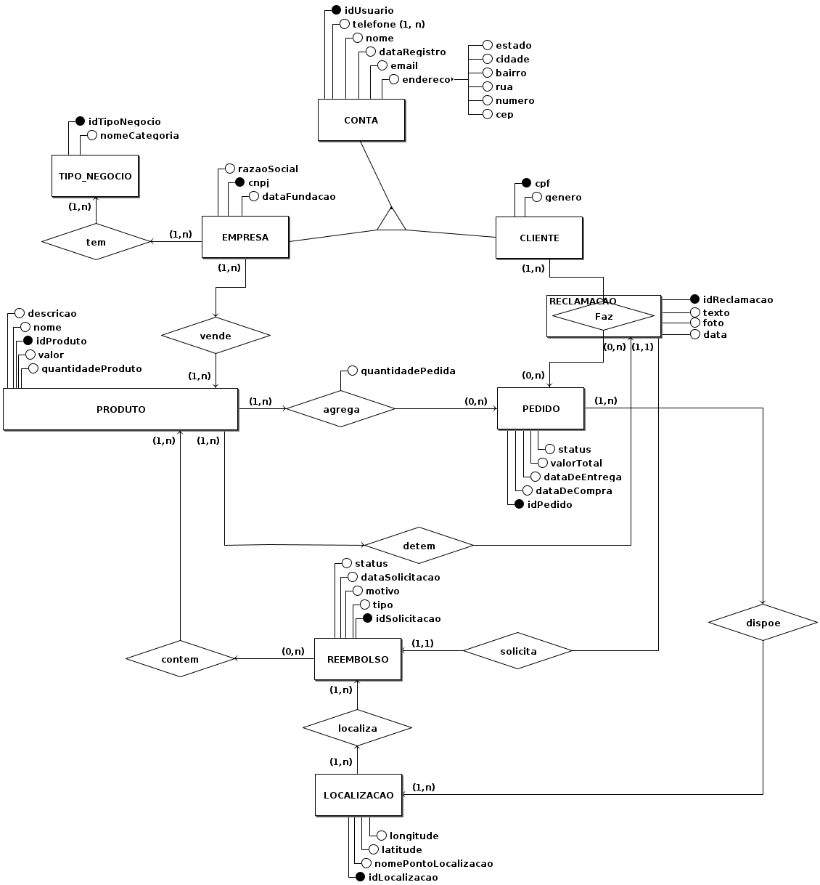
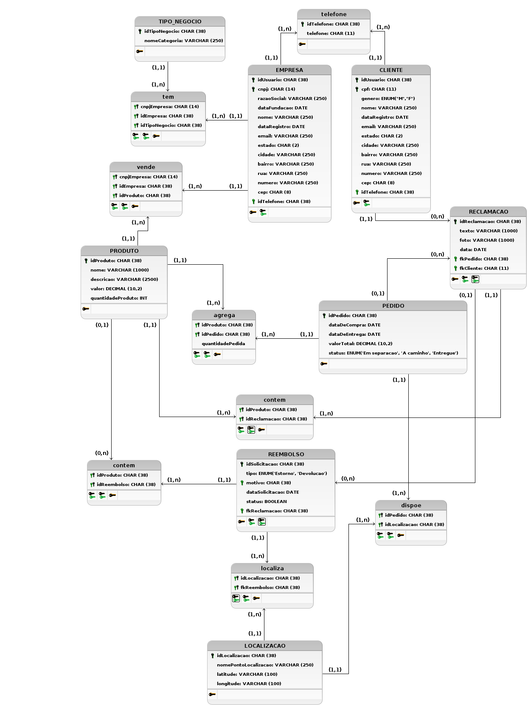
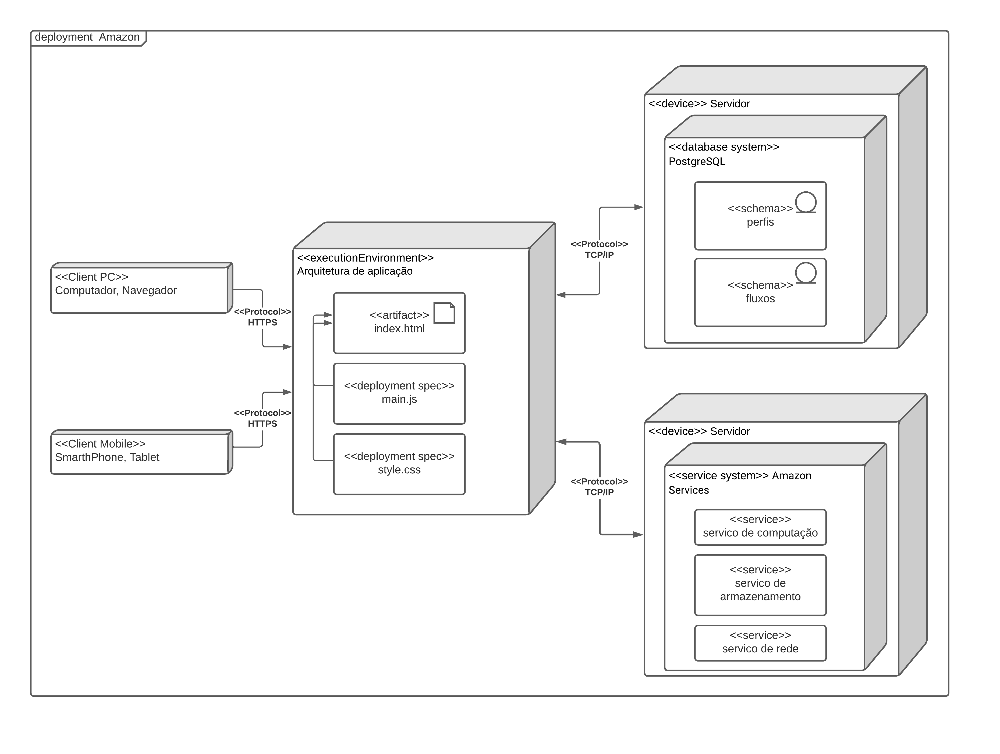

# Módulo Estilos e Padrões Arquiteturais

## Visão de dados

Os diagramas de Linguagem de Definição de Dados (DLD) e Diagrama de Entidade-Relacionamento (DER) são ferramentas cruciais na modelagem e compreensão da estrutura de dados de um sistema. No contexto de reimaginar a Amazon, com foco nos perfis de comprador e vendedor e na plataforma que suporta processos de reclamação, devolução e estornos, estes diagramas ganham uma relevância ainda maior.

A visão de dados é fundamental porque ela define como as informações são armazenadas, relacionadas e acessadas. Em uma plataforma de e-commerce, onde diversas transações e interações acontecem, a modelagem correta de dados garante que o sistema seja eficiente, confiável e capaz de escalar conforme o crescimento do negócio. Além disso, uma boa estrutura de dados ajuda na manutenção do sistema, facilita a integração com outras plataformas e contribui para a análise de dados, o que pode levar a insights.

O DLD e o DER permitem a visualização das entidades-chave, como clientes, pedidos e produtos, e as relações entre elas. Por exemplo, um cliente pode fazer vários pedidos, e cada pedido pode incluir múltiplos produtos. Além disso, a capacidade de processar reclamações, devoluções e estornos de forma eficiente é crucial para a satisfação do cliente e para a operação financeira da plataforma.

<figcaption style="text-align: center">
    <b>Figura 1: Visão de dados - DER</b>
</figcaption>

<figcaption style="text-align: center">
   <b>Autor: Elaboração Própria (Lucas Frazão e Lucas Lopes)</b>
</figcaption>

<figcaption style="text-align: center">
    <b>Figura 2: Visão de dados - DLD</b>
</figcaption>

<figcaption style="text-align: center">
   <b>Autor: Elaboração Própria (Lucas Frazão e Lucas Lopes)</b>
</figcaption>

## Visão de Implantação

O diagrama de Implantação é uma das ferramentas fundamentais da linguagem de modelagem unificada (UML), que é amplamente utilizada para visualizar, especificar, construir e documentar sistemas de software. O diagrama de Implantação concentra-se na disposição física dos elementos do sistema em hardware dedicado.

Após uma extensa pesquisa relacionada ao modelo de implantação e à estrutura física do site da Amazon, conseguimos desenvolver um diagrama que ilustra de maneira simplificada a complexidade da infraestrutura por trás desse comércio eletrônico. Esse diagrama não apenas representa a disposição física dos componentes do sistema, mas também destaca as interconexões vitais que possibilitam a operação contínua e escalável da plataforma.

<figcaption style="text-align: center">
    <b>Figura 1: Diagrama de Implementa</b>
</figcaption>

<figcaption style="text-align: center">
   <b>Autor: Elaboração Própria (Mateus de Almeida e Arthur Vinicius)</b>
</figcaption>

## Histórico de versão

| Versão |    Data    |             Descrição             |                             Autor                             |                                  Revisor                                  |
| :----: | :--------: | :-------------------------------: | :-----------------------------------------------------------: | :-----------------------------------------------------------------------: |
|  1.0   | 30/11/2023 |   Adição de Visão de Dados    | Lucas Frazão e Lucas Lopes |  |
|  1.1   | 30/11/2023 |   Adição de Visão de Implantação    | Mateus de Almeida |  |
