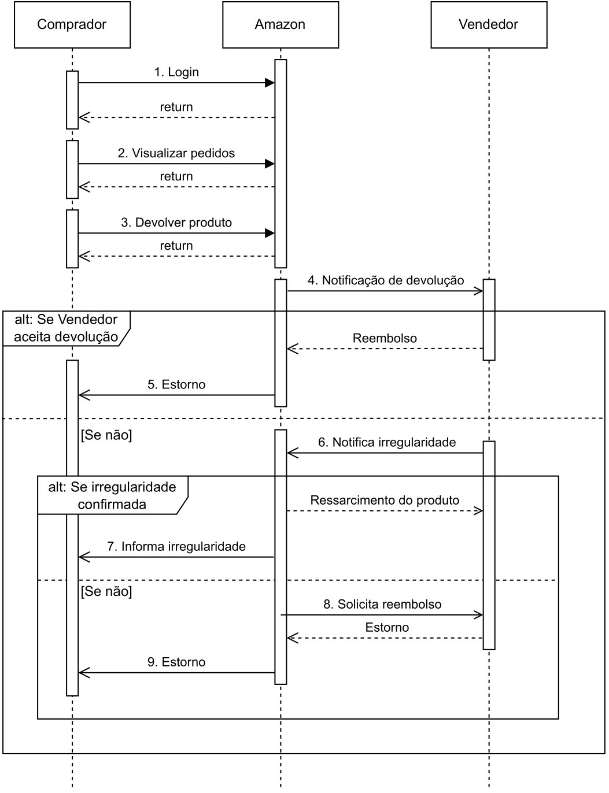
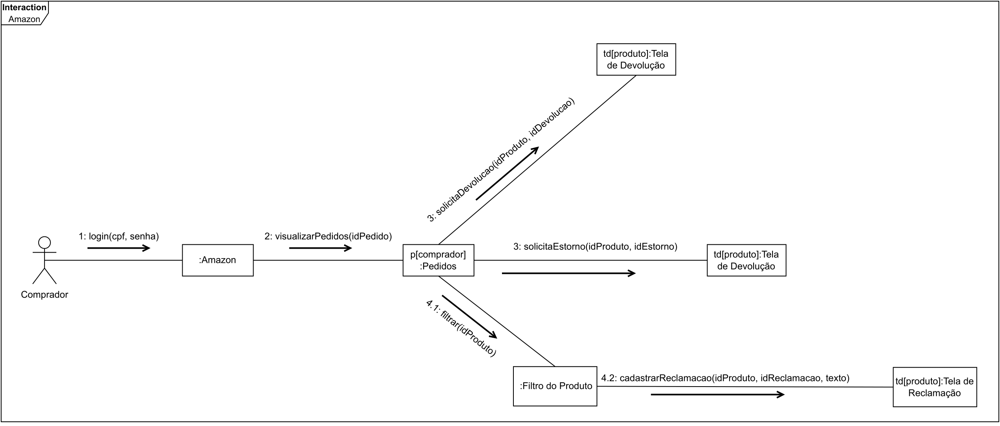
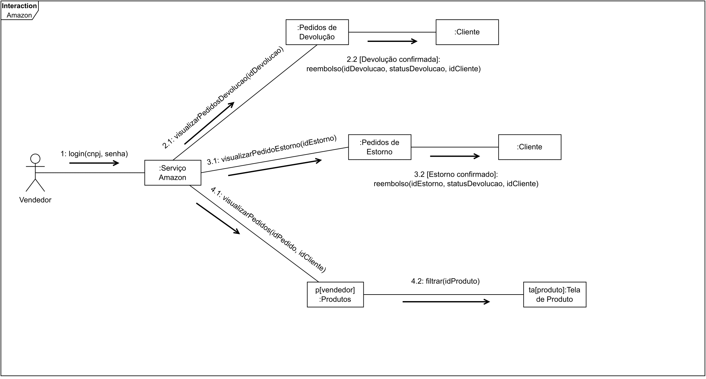
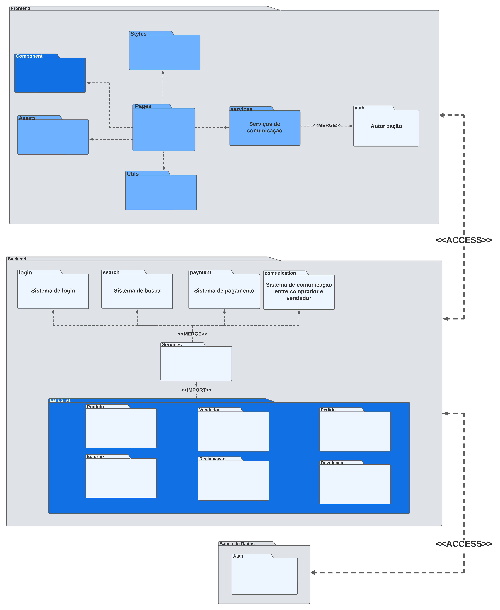
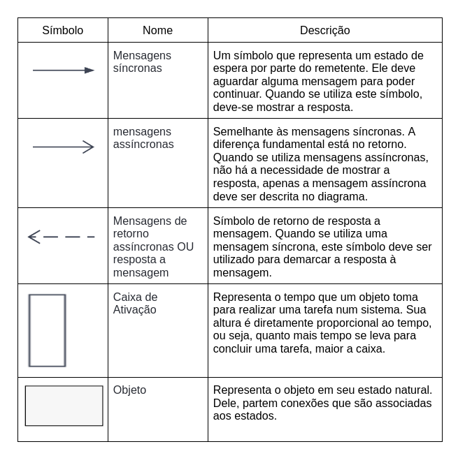
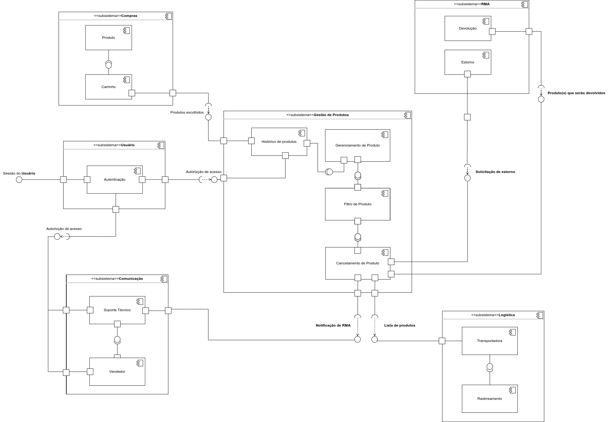

# 1. Módulo Estilos e Padrões Arquiteturais

## 2. Introdução

Este artefato visa demonstrar as escolhas de estilo e padrões arquiteturais da equipe e decisões de para contornar quais problemas que os mesmos tiveram durante seu desenvolvimento, sendo escolhido pela equipe abordar 4 visões, a lógica, a de processos, de implementação, de implantação e a visão de dados, foi omitido a visão de casos de uso devido ao tempo útil para o desenvolvimento disponível e a disponibilidade do membro. O padrão arquitetural a ser utilizado pela equipe será o MVC, apesar de não está muito aparente devido ao modo em que será desenvolvido. 

## 3. Visão Lógica

## 3.1 Metodologia

A Metodologia utilizada para desenvolver a visão lógica iniciou-se com uma reunião no dia 21/10 para a atribuição das necessidades a serem desenvolvidas entre os componentes decididos a ficarem responsáveis por essa parte como responsabilidade principal e se necessário outros membros para auxiliarem. Entretanto, durante o desenvolvimento, mas específico no dia 23/10, houve a necessidade de todo mundo do grupo participar para contribuir e adicionar na etapa de Reutilização como definido pelo componente do grupo Lucas Frazão. 
Dessa maneira, foram desenvolvidas uma versão final do diagrama de classes refatorado, trabalhando junto a si de padrões de projetos para tornar a arquitetura mais eficiente, além da necessidade de apresentar a necessidade de trabalhar com alguns serviços da Amazon, também foram adicionados, o diagrama de sequência, diagrama de comunicação e o de diagrama de pacotes, esses diagramas também sofreram algumas alterações desde erros de português(diagrama de sequência) até uma reestruturação ou refatoração do que foi feito anteriormente(diagrama de pacotes e comunicação). 
Até o período do dia 30/11, esse diagramas sofreram algum tipo de consulta com que os fez para se entender o que poderia ser melhorado, com base no que especificado pela professora Milene Serrano.

## 3.2 Diagrama de Classes

### 3.2.1 Versão 1

Na Versão 1 do diagrama de classes, houve somente uma refatoração do diagrama acrescentando os parâmetros aos métodos existentes, além da adição de uma nova maneira de descreve a relação entre as duas tabelas e entender o relacionamento existente com o verbo+substantivo descrito para demonstrar a relação entre as tabelas.

### 3.2.2  Versão 2 

Na segunda versão, a alteração realizada, foi para se adaptar a linguagem escolhida pelo grupo, sendo o typescript a linguagem escolhida, dessa forma o diagrama de classe foi refeito para se adaptar as limitações ou especificações do typescript.  

<figcaption style="text-align:center">
    <b>Figura 1: Diagrama de Classes Versão 2</b>
</figcaption>

<figcaption style="text-align: center">
<b> Autor: Elaboração Própria (Gabriel, Samuel, Henrique, Lucas Frazão, Chaydson, Artur, Mateus, Pedro Helias e Pedro Henrique; 2023)</b>
</figcaption>

### 3.2.3  Versão Final

Na versão final do diagrama de classe, nesse foram adicionadas os padrões de projetos criados pelos outros componentes do grupo.

<figcaption style="text-align:center">
    <b>Figura 2: Diagrama de Classes Versão Final</b>
</figcaption>

<figcaption style="text-align: center">
<b> Autor: Elaboração Própria (Gabriel, Samuel, Henrique, Lucas Frazão, Chaydson, Artur, Mateus, Pedro Helias e Pedro Henrique; 2023)</b>
</figcaption>

## 3.3 Diagrama de Sequências
O diagrama de Sequências também permite saber como logicamente o sistema irá funcionar representando o fluxo(ações) feito pelas atividades realizadas pelo caminho definido ou imaginado pelos construtores do sistemas.

<figcaption style="text-align: center">
<b> Figura 3: Diagrama de Sequência</b>
</figcaption>

<figcaption style="text-align: center">

</figcaption>
<figcaption style="text-align: center">
<b> Autor: Elaboração Própria (Gabriel, Lucas Frazão, Chaydson; 2023)</b>
</figcaption>

## 3.4 Diagrama de Comunicação

O diagrama de Comunicação de comunicação ou colaboração também permite demonstrar e descrever as interações feitas entre objetos, que estão representados tambpem no diagrama de classe. Representando também uma parte lógica do sistema.

 
 

<figcaption style="text-align: center">
<b> Figura 4: Diagrama de Comunicação parte Comprador</b>
</figcaption>

<figcaption style="text-align: center">
<b> Autor: Elaboração Própria (Gabriel, Lucas, Artur; 2023)</b>
</figcaption>

 

<figcaption style="text-align: center">
<b> Figura 5: Diagrama de Comunicação parte Vendedor</b>
</figcaption>

<figcaption style="text-align: center">
<b> Autor: Elaboração Própria (Gabriel, Lucas, Artur; 2023) </b>
</figcaption>

## 3.5 Diagrama de Pacotes

O diagrama de Pacotes, serve para demonstrar a arquitetura e estruturas estáticas a um macro nível das pastas e como a mesmas se interrelacionam, desse jeito é possível inferir como os mesmos deverão agir o sistema for desenvolvido simplificando certos processos.

<figcaption style="text-align: center">
<b> Figura 6: Diagrama de Pacotes</b>
</figcaption>

<figcaption style="text-align: center">
 <b> Autor: Elaboração Própria (Gabriel, Lucas Frazão, Chaydson; 2023) </b>
</figcaption>

# 4. Visão de Processos

## 4.1 Introdução

Na documentação de um projeto de software, a Visão de Processos busca documentar e descrever processos utilizados, atividades, fluxos de trabalho, metodologias, evolução do software, entre outros pontos. Sua construção é capaz de descrever como diferentes partes/setores, correspondentes ao projeto, colaboram para atingir os objetivos determinados. A visão correspondentemente "macro" de uma organização tende a simplificar e facilitar o entendimento a respeito das relações entre as partes que compõe o projeto.

Na elaboração da Visão de Processos, deve se considerar os componentes, que compõe o ecossistema dos processos. Por sua vez, os processos determinam quais componentes serão executados. A comunicação também deve ser considerada, uma vez que a forma e o protocolo utilizado são de elevada importância. Há questões de segurança atreladas na comunicação. É importante também buscar o sincronismo entre essas partes. 

A visão de processos traz alguns beneicios, como: Organização e maior entendimento a respeito dos processos adotados, como os mesmos acontecem, e como a relação entre as partes ocorre; agilidade na execução das atividades; simplifica mais ainda o processo de buscas por gargalos, entre outros. 

## 4.2 Diagramação

Para representar o modelo documental, utiliza-se um outro modelo mais visual, na forma de diagrama, denominado por Diagrama de Sequência. Este documento pode ser utilizado para representar como diferentes partes de um sistema de encaixam/conectam e como trabalham juntas, mas em forma de diagrama. 

Para este projeto, foi elaborado um Diagrama de Sequência com o intuito de esclarecer as relações dentro do fluxo selecionado para o grupo, além de seus componentes internos e os relacionamentos entre sistemas. 

## 4.3 Tabela de símbolos 

A simbologia para construção do diagrama respeita a legenda encontrada na tabela abaixo. Os mais comuns estão descritos.

<figcaption style="text-align: center">
    <b>Figura 7: Tabela de Símbolos</b>
</figcaption>

<figcaption style="text-align: center">
   <b>Autor: Elaboração Própria (Pedro Helias; 2023)</b>
</figcaption>

## 4.4 Diagrama de Sequência

<figcaption style="text-align: center">
    <b>Figura 8: Diagrama de Sequência</b>
</figcaption>

<figcaption style="text-align: center">
   <b>Autor: Elaboração Própria (Chaydson Ferreira Henrique, Gabriel Ferreira e Lucas Frazão; 2023)</b>
</figcaption>

# 5. Visão de Implementação

O Diagrama de Arquitetura de Software (DAS) é uma representação que revela a disposição e interações dos elementos de um sistema de software. Ele oferece uma visão global da arquitetura, destacando conexões entre componentes, estrutura em camadas e hierarquias. Essencialmente, o DAS facilita a análise das mudanças, identificação de problemas de design e excesso de dependências ao mostrar entradas, saídas, fluxo de dados, interfaces e interconexões entre os elementos do sistema. Em suma, parte do diagrama de componentes para visualizar e descrever as conexões e interdependências dos componentes, proporcionando compreensão da arquitetura completa do sistema.

## 5.1 Metodologia
Foi realizada uma reunião remota, onde analisamos as correções apontadas pela professora sobre o diagrama em questão e após revisar o conteúdo por meio das aulas gravadas e da bibliografia corrigimos os pontos de melhoria aplicados. O diagrama foi feito de forma simultânea onde analisamos e discutimos como aplicar os conceitos aprendidos.

## 5.2 Diagrama de Componentes

À seguir, na <i> Figura 1</i>, estará representado o diagrama de componentes proposto pelo grupo, utilizando-se das técnicas de UML em sua formação. Vale ressaltar que a sigla RMA significa Return Merchandise Authorization.

<figcaption style="text-align: center">
    <b>Figura 9: Diagrama de Componentes (UML)</b>
</figcaption>

<figcaption style="text-align: center">
   <b>Autor: Elaboração Própria (Henrique Pucci, Chaydson Ferreira; 2023)</b>
</figcaption>

## 5.3 Componentes

Os componentes representam unidades funcionais que desempenham papéis específicos no sistema, fornecendo serviços ou funcionalidades essenciais. São como peças fundamentais que compõem o sistema, cada uma com suas próprias funções e responsabilidades.

Originados do diagrama de classes, os componentes foram estruturados em subsistemas individuais, cada um interagindo através de solicitações ou disponibilizando interfaces/serviços. A análise detalhada de cada componente e seus relacionamentos é crucial para compreender como operam e se conectam no sistema.

- **Usuário:** O componente pai é o componente _"Usuário"_, que é composto pelo componente filho `Autenticação`. Nessa seção, o usuário é autenticado, e recebe a autorização para acessar outras partes do sistema.
- **Compras:** O componente pai é o componente _"Compras"_, que é composto por dois componentes filho:`Carrinho` e `Produto`. O componente `Produto` armazena dados sobre os produtos que estão disponíveis na plataforma, ea partir dele, é estabelecido o componente `Carrinho`, que terá os produtos escohidos pelo usuário.
- **Cominicação:** O componente pai é o componente _"Comunicação"_, que é composto por dois componentes filho:`Suporte Técnico` e `Vendedor`. Os dois componentes filho podem ser solicitados, após o envio de uma solicitação de RMA, ou diretamente pelo próprio usuário.
- **Logística:** O componente pai é o componente _"Logística"_, que é composto por dois componentes filho:`Rastreamento` e `Transportadora`. O componente filho `Transportadora` será solicitado após o envio de uma lista de produtos, que vieram a partir do cancelamento de uma compra. E consequentemente, o `Rastreio` estará sendo solicitado.
- **Gestão de produtos:** O componente pai é o componente _"Gestão de Produtos"_, que é composto pelos componentes:`Historico de Produtos`, `Gerenciamento de Produto`, `Filtro de Produto` e `Cancelamento de Produto`. Esses componentes foram projetados com base nos serviços que os usuários usarão na plataforma, cada parte representa uma função da plataforma. Por exemplo em `Histórico de Produtos`, o usuário pode acessar os produtos selecionados, e com o gerenciamento dos produtos selecionados, em `Cancelamento de Produto` o usuário efetuará o cancelamento da compra de seu produto selecionado.
- **RMA:** O componente pai é o componente _"RMA(Return Material Authorization)"_, que é composto por dois componentes filho:`Devolução` e `Estorno`. Esses dois componentes representam os dois tipos de retorno após o cancelamento de um produto pelo usuário.

## 5.4 Relacionamentos e dependências
Com os relacionamentos será possível entender como os diferentes subsistemas se relacionam entre si, possibilitando uma compreensão profunda sobre o funciona da aplicação.

A seguir temos os relacionamentos modelados no diagrama:

- **Usuário - Comunicação:** O componente `Usuário` garantirá um acesso seguro ao componente de `Comunicação`, onde o usuário terá acesso ao suporte técnico bem como as partes relacionadas com o vendedor.
- **Gestão de produtos - Comunicação:** Esse relacionamento é muito importante, pois o componente de `Comunicação` será comunicado pelo componente de `Gestão de Produtos` um cancelamento ou reembolso do pedido for requerido, permitindo uma comunicação eficiente entre as partes.
- **Gestão de produtos - Logística:** Aqui teremos o relacionamento entre o componente `Gestão de Produtos` e `Logística`. Como o transporte de mercadorias será efetuado, a transportadora será informada sobre como processar com os produtos que deverão ser entregues.
- **Compras - Gestão de produtos:** Nesse relacionamento o componente `Compras` fornecerá para o componente `Gestão de Produtos` os produtos escolhidos pelo usuário, permitindo a execução da compra.
- **RMA - Gestão de produtos:** O componente `RMA` mandara para o componente `Gestão de Produtos` as informações necessárias para a realização do procedimento de estorno ou devolução do produto.

## 6. Visão de Implantação

O diagrama de Implantação é uma das ferramentas fundamentais da linguagem de modelagem unificada (UML), que é amplamente utilizada para visualizar, especificar, construir e documentar sistemas de software. O diagrama de Implantação concentra-se na disposição física dos elementos do sistema em hardware dedicado.

Após uma extensa pesquisa relacionada ao modelo de implantação e à estrutura física do site da Amazon, conseguimos desenvolver um diagrama que ilustra de maneira simplificada a complexidade da infraestrutura por trás desse comércio eletrônico. Esse diagrama não apenas representa a disposição física dos componentes do sistema, mas também destaca as interconexões vitais que possibilitam a operação contínua e escalável da plataforma.

<figcaption style="text-align: center">
    <b>Figura 10: Diagrama de Implementa</b>
</figcaption>

<figcaption style="text-align: center">
   <b>Autor: Elaboração Própria (Mateus de Almeida e Arthur Vinicius; 2023)</b>
</figcaption>

## 7. Visão de dados

Os diagramas de Linguagem de Definição de Dados (DLD) e Diagrama de Entidade-Relacionamento (DER) são ferramentas cruciais na modelagem e compreensão da estrutura de dados de um sistema. No contexto de reimaginar a Amazon, com foco nos perfis de comprador e vendedor e na plataforma que suporta processos de reclamação, devolução e estornos, estes diagramas ganham uma relevância ainda maior.

A visão de dados é fundamental porque ela define como as informações são armazenadas, relacionadas e acessadas. Em uma plataforma de e-commerce, onde diversas transações e interações acontecem, a modelagem correta de dados garante que o sistema seja eficiente, confiável e capaz de escalar conforme o crescimento do negócio. Além disso, uma boa estrutura de dados ajuda na manutenção do sistema, facilita a integração com outras plataformas e contribui para a análise de dados, o que pode levar a insights.

O DLD e o DER permitem a visualização das entidades-chave, como clientes, pedidos e produtos, e as relações entre elas. Por exemplo, um cliente pode fazer vários pedidos, e cada pedido pode incluir múltiplos produtos. Além disso, a capacidade de processar reclamações, devoluções e estornos de forma eficiente é crucial para a satisfação do cliente e para a operação financeira da plataforma.

<figcaption style="text-align: center">
    <b>Figura 11: Visão de dados - DER</b>
</figcaption>

<figcaption style="text-align: center">
   <b>Autor: Elaboração Própria (Lucas Frazão e Lucas Lopes; 2023)</b>
</figcaption>

 
 

<figcaption style="text-align: center">
    <b>Figura 12: Visão de dados - DLD</b>
</figcaption>

<figcaption style="text-align: center">
   <b>Autor: Elaboração Própria (Lucas Frazão e Lucas Lopes; 2023)</b>
</figcaption>

## 8. Referências

> Curso de UML O que é um Diagrama de Classes. Disponível em: <https://youtu.be/JQSsqMCVi1k?si=94cGZA2LdO1laBZz>. Acesso em: 21 de out. de 2023.

> Nikiforova, Oksana & Sejans, Janis & Cernickins, Antons. (2011). Role of UML Class Diagram in Object-Oriented Software Development. J. Riga Technical University. 44. 65-74. 10.2478/v10143-011-0023-4. Disponível em: <https://www.researchgate.net/publication/220625913_Role_of_UML_Class_Diagram_in_Object-Oriented_Software_Development> .Acesso em: 21 de out. de 2023.

> Diagrama de Comunicação. Disponível em: <https://unbarqdsw2020-2.github.io/2020.2_G5_EasyCoffee/#/entrega2/diagramas_uml/diagrama_de_comunicacao>. Acesso em: 25 nov. 2023.

> FAKHROUTDINOV, K. UML communication diagrams overview - graphical notations for lifeline, message, etc.. Disponível em: <https://www.uml-diagrams.org/communication-diagrams.html>. Acesso em: 29 nov. 2023.

> Diagrama de sequência para aplicações modernas. Pisani da ArcH. Disponível em: referência. Acesso em 29 nov. 2023.

> What is Package Diagram? Visual-paradigm.com. Disponível em: <https://www.visual-paradigm.com/guide/uml-unified-modeling-language/what-is-package-diagram/>. Acesso em: 30 nov. 2023.

> GITMIND. What is Package Diagram and How to Create: Explain with Templates. Gitmind.com. Disponível em: <https://gitmind.com/package-diagram.html>. Acesso em: 30 out. 2023.

> O que é um diagrama de sequência UML?. Disponível em: <https://www.lucidchart.com/pages/pt/o-que-e-diagrama-de-sequencia-uml">. Acesso em: 26 nov. 2023.

> Diagramas de Seqüência. Disponível em: <https://www.ibm.com/docs/pt-br/rsm/7.5.0?topic=uml-sequence-diagrams">. Acesso em: 26 de nov de 2023.

> Diagrama de componentes UML: o que é, como fazer e exemplos. Disponível em: <https://www.lucidchart.com/pages/pt/diagrama-de-componentes-uml>. Acesso em: 30 nov. 2023.

> UML Component Diagrams. Disponível em: <https://www.uml-diagrams.org/component-diagrams.html>. Acesso em: 30 nov. 2023.

> The Unified Modeling Language. Disponível em: <https://www.uml-diagrams.org/>. Acesso em: 30 nov. 2023.

> Arquitetura e Desenho de Software - Aulas de ARQUITETURA & DAS - Prof. Milene

> Guia Completa de PostgreSQL: PostgreSQL do Básico ao Avançado.  Disponível em: <https://www.devmedia.com.br/guia/tecnologia-postgresql/34328>. Acesso em: 25 nov. 2023.

> Tipos de computação em nuvem. Dísponível em: <https://aws.amazon.com/pt/types-of-cloud-computing/>. Acesso em: 29 nov. 2023.

> IBM Diagramas de Implementação. Disponivel em: <https://aws.amazon.com/pt/types-of-cloud-computing/>. Acesso em: 29 nov. 2023

## Histórico de versão

| Versão |    Data    |             Descrição             |                             Autor                             |                                  Revisor                                  |
| :----: | :--------: | :-------------------------------: | :-----------------------------------------------------------: | :-----------------------------------------------------------------------: |
|   1.0   | 23/11/2023 | Criação inicial do documento | Gabriel Ferreira, Samuel Gomes e Pedro Henrique | Chaydson e Henrique |
|   1.1   | 25/11/2023 | Revisão Diagrama de Classe | Gabriel Ferreira, Samuel Gomes e Pedro Henrique | Chaydson e Henrique |
|  1.2   | 26/11/2023 |   Adição de Visão de Processos    | Pedro Helias | Gabriel |
| 1.3 | 25/11/2023 | Criação inicial do documento | Lucas Rocha e Lucas Frazão | Artur Vinicius |
| 1.4 | 27/11/2023 | Adição da v1.1 dos diagramas | Lucas Rocha e Lucas Frazão | Artur Vinicius |
|   1.5   | 29/11/2023 | Alteração de Diagrama de Classes | Gabriel Ferreira e Lucas| Pedro |
|   1.6   | 30/11/2023 | Adicionando de Diagrama de Sequência | Gabriel Ferreira| Lucas Frazão |
|   1.7   | 30/11/2023 | Adicionando de Diagrama de Comunicação | Gabriel Ferreira| Lucas Frazão |
|   1.8   | 30/11/2023 | Adicionando de Diagrama de Pacotes | Gabriel Ferreira| Lucas Fazão |
|   1.9   | 30/11/2023 | Revisão Diagrama de Classe Adicionando Padrões | Gabriel Ferreira, Samuel Gomes e Pedro Henrique, Henrique, Artur | Chaydson, Lucas Lopes e Helias |
|  1.10   | 30/11/2023 |   Adição de Visão de Dados    | Lucas Frazão e Lucas Lopes | Gabriel Ferreira |
|  1.11   | 30/11/2023 |   Adição de Visão de Implantação    | Mateus de Almeida, Artur | Lucas Frazão |
|  1.12   | 01/12/2023 |   Adição de Novo Diagrama de Classes    | Gabriel Ferreira | Chaydson |
