# Reutilização de Software

## Filtragem - Strategy

O padrão de design Strategy é particularmente útil quando temos um conjunto de algoritmos que são semelhantes na sua finalidade mas variam em sua implementação. No contexto da filtragem de produtos, como indicado no UML e nos códigos fornecidos, a utilização desse padrão oferece uma série de vantagens que estão fortemente ligadas ao princípio de reutilização de software.

Primeiramente, ao definir uma interface comum Filtro, garantimos que diferentes estratégias de filtragem possam ser intercambiadas sem que a classe de contexto tenha que ser alterada. Isso não apenas promove a reutilização do código da classe de contexto, mas também permite que novas estratégias de filtro sejam adicionadas no futuro com facilidade, sem a necessidade de modificar as classes existentes.

Além disso, cada classe de estratégia é responsável apenas por uma forma de filtragem, seguindo o princípio da responsabilidade única. Isso torna cada classe mais fácil de entender, testar e manter. A reutilização é melhorada porque cada estratégia de filtragem pode ser desenvolvida e modificada de forma independente das outras, permitindo que elas sejam reutilizadas em diferentes partes do sistema onde essa forma específica de filtragem é necessária.

Outro ponto importante é a eliminação de condicionais complexas no código. Sem o uso do Strategy, a lógica de filtragem poderia resultar em um grande número de if-else ou switch statements que escolhem o algoritmo de filtragem apropriado com base em algum critério. Isso não só torna o código mais difícil de ler e manter, mas também dificulta a adição de novos critérios de filtragem. O padrão Strategy encapsula essa lógica dentro das classes de estratégia, mantendo o código da classe de contexto limpo e focado na sua função principal.

A reutilização de software é maximizada porque o padrão Strategy facilita a manutenção e a extensão das funcionalidades de filtragem. Novos filtros podem ser adicionados sem alterar o código existente, o que é uma vantagem significativa em termos de economia de tempo e recursos. Essa abordagem modular e flexível reduz o acoplamento e aumenta a coesão, o que são indicadores-chave de um bom design de software reutilizável.

<figcaption style="text-align: center">
    <b>Figura 1: Diagrama filtro usando Strategy</b>
</figcaption>

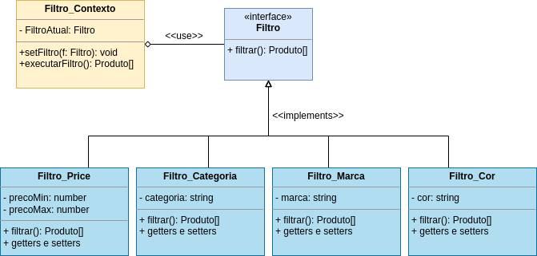

<figcaption style="text-align: center">
   <b>Autor: Elaboração Própria (Lucas Frazão e Lucas Lopes)</b>
</figcaption>

A imagem mostra codificação de produtos no contexto da filtragem. Essa visualização ajuda a entender como os produtos são definidos e categorizados no sistema, o que é essencial para aplicar corretamente as estratégias de filtragem.

<figcaption style="text-align: center">
    <b>Figura 2: Tipagem de produto</b>
</figcaption>

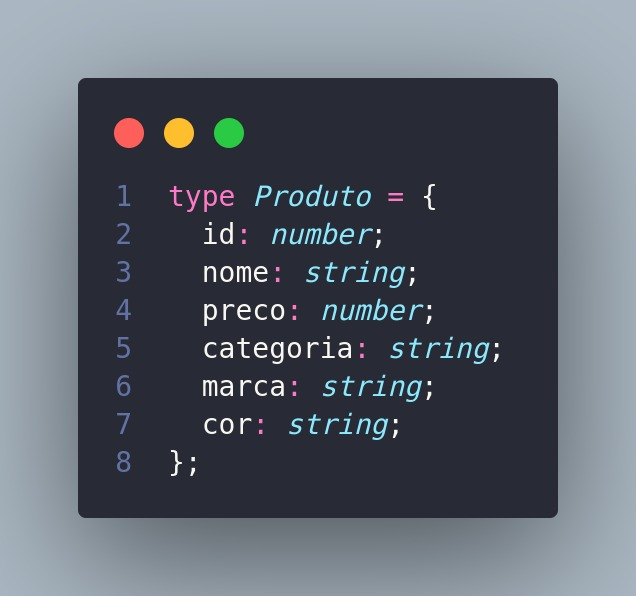

<figcaption style="text-align: center">
   <b>Autor: Elaboração Própria (Lucas Frazão e Lucas Lopes)</b>
</figcaption>

Aqui, o foco é na interface Filtro, que define o contrato para as diferentes estratégias de filtragem.

<figcaption style="text-align: center">
    <b>Figura 3: Interface do Filtro</b>
</figcaption>

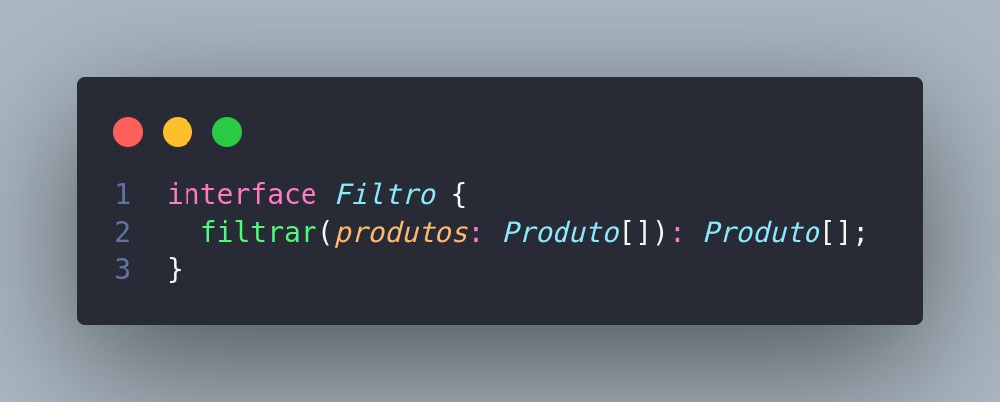

<figcaption style="text-align: center">
   <b>Autor: Elaboração Própria (Lucas Frazão e Lucas Lopes)</b>
</figcaption>

Esta imagem mostra um exemplo concreto de uma classe de filtro que implementa a interface Filtro.

<figcaption style="text-align: center">
    <b>Figura 4: Exemplo de um filtro que implementa a interface filtro</b>
</figcaption>

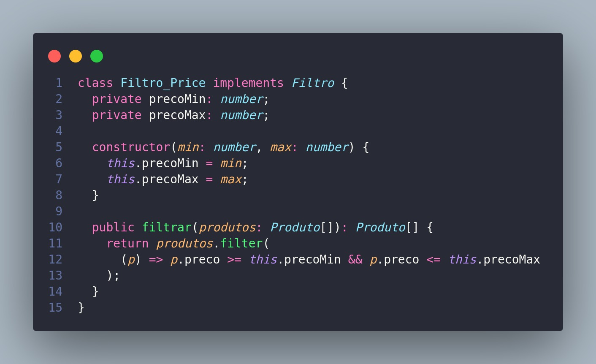

<figcaption style="text-align: center">
   <b>Autor: Elaboração Própria (Lucas Frazão e Lucas Lopes)</b>
</figcaption>

A imagem representa a classe de contexto no padrão Strategy, que utiliza a interface Filtro. Mostra como diferentes estratégias de filtragem podem ser aplicadas em um contexto específico, demonstrando a flexibilidade e a reusabilidade do design.

<figcaption style="text-align: center">
    <b>Figura 5: Contexto para o filtro</b>
</figcaption>

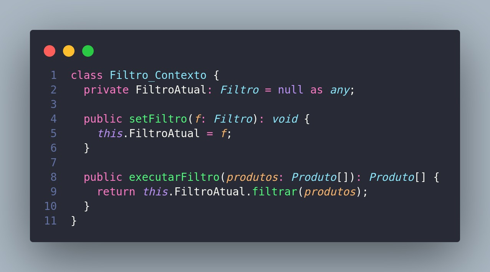

<figcaption style="text-align: center">
   <b>Autor: Elaboração Própria (Lucas Frazão e Lucas Lopes)</b>
</figcaption>

Esta figura ilustra a função principal de um programa que utiliza o padrão Strategy para filtragem. Serve para demonstrar como tudo se junta em um exemplo de aplicação real, mostrando o uso prático das classes e interfaces definidas nas imagens anteriores.

<figcaption style="text-align: center">
    <b>Figura 6: Função main</b>
</figcaption>

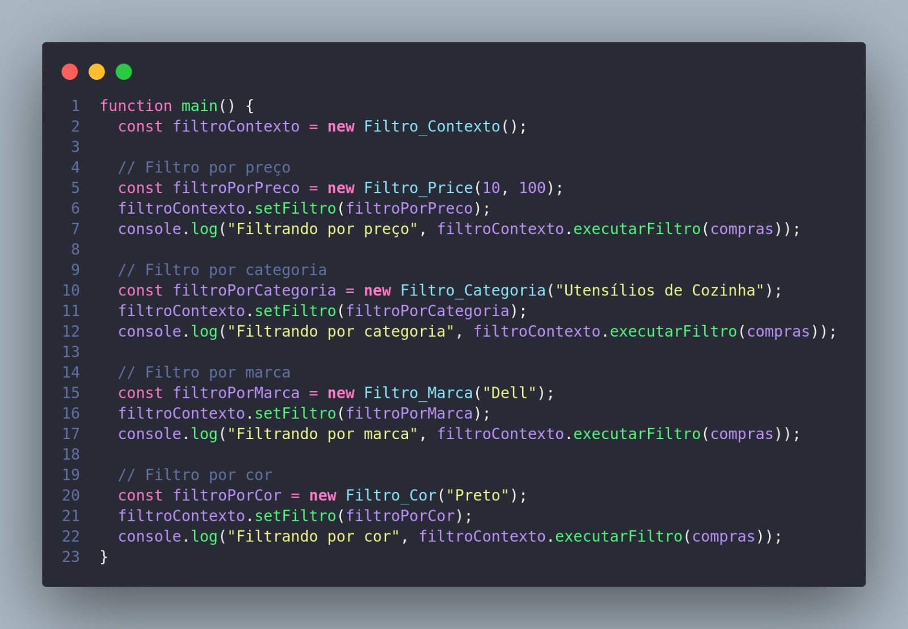

<figcaption style="text-align: center">
   <b>Autor: Elaboração Própria (Lucas Frazão e Lucas Lopes)</b>
</figcaption>

## Estados de devolução - State

O padrão de projeto State é extremamente útil para o gerenciamento de estado em situações onde um objeto pode alterar seu comportamento quando o seu estado interno muda. Quando lidamos com devoluções, temos diferentes estados pelos quais um item pode passar: pendente, em análise, aceito, rejeitado, entre outros. Cada estado desses pode ter comportamentos específicos associados, como verificar se o item está danificado, notificar o cliente sobre a aceitação ou rejeição da devolução, entre outros.

O padrão State permite modelar cada estado da devolução como uma classe separada, encapsulando o comportamento específico associado a cada estado. Isso ajuda a manter o código organizado, facilitando a adição de novos estados e evitando que a lógica relacionada a diferentes estados se misture. Além disso, o padrão State promove a coesão e a manutenção do código, já que cada estado está isolado em sua própria classe, tornando mais fácil entender, testar e modificar o comportamento de cada estado sem afetar os outros.

A **Figura 7** apresenta a modelagem do padrão state no contexto de gerenciamento de estados da devolução.

<figcaption style="text-align: center">
    <b>Figura 7: Modelagem do gerenciamento de estados da devolução utilizando o padrão state.</b>
</figcaption>

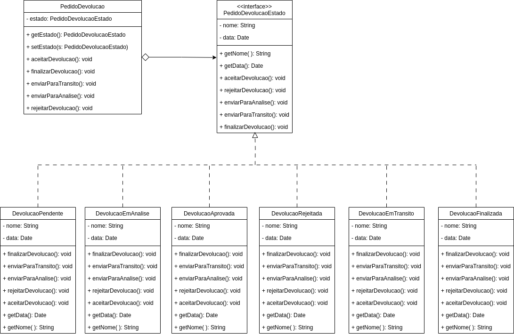

<figcaption style="text-align: center">
   <b>Autor: Elaboração Própria (Samuel Gomes e Gabriel Ferreira)</b>
</figcaption>

Agora, será mostrada a implementação desse padrão. Começando com a implementação da interface como mostra a **Figura 8**. A interface no padrão State é essencial como uma estrutura comum para os diferentes estados. Ela define os métodos que representam as operações possíveis nos estados. Essa abstração permite que os estados concretos implementem esses métodos de forma específica, garantindo que o contexto possa interagir uniformemente com os estados, independente de suas particularidades. Isso mantém a flexibilidade do código ao adicionar novos estados sem mudar a interface do contexto.

<figcaption style="text-align: center">
    <b>Figura 8: Implementação da Interface</b>
</figcaption>

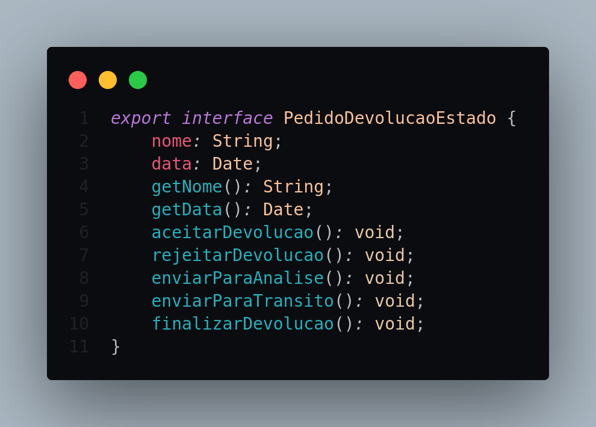

<figcaption style="text-align: center">
   <b>Autor: Elaboração Própria (Samuel Gomes e Gabriel Ferreira)</b>
</figcaption>

A **Figura 9** apresenta a implementação do contexto. O contexto no padrão State é responsável por conter uma instância do estado atual e por delegar as chamadas dos métodos para o estado correspondente. Ele interage diretamente com a interface do estado, possibilitando a mudança dinâmica do estado em tempo de execução. Além disso, o contexto fornece métodos que permitem a transição entre os diferentes estados, controlando o fluxo da aplicação e coordenando as operações conforme o estado atual. Essa separação entre o contexto e os estados permite que o contexto mantenha seu funcionamento independentemente das mudanças nos comportamentos dos estados.

<figcaption style="text-align: center">
    <b>Figura 9: Implementação do contexto</b>
</figcaption>

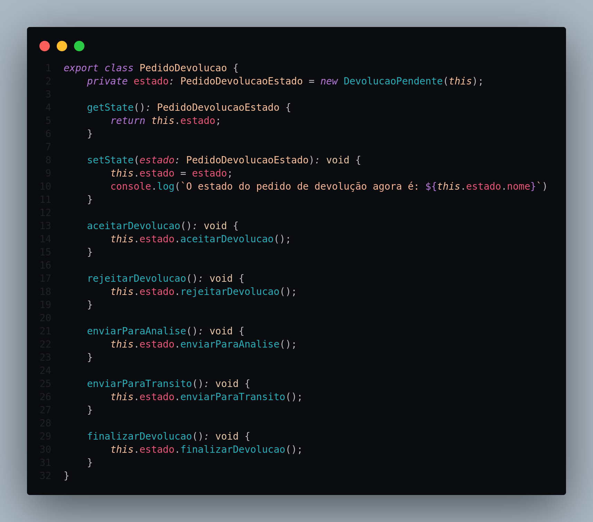

<figcaption style="text-align: center">
   <b>Autor: Elaboração Própria (Samuel Gomes e Gabriel Ferreira)</b>
</figcaption>

As **Figuras 10 a 15** mostram a implementação dos estados. Os estados no padrão State representam as diferentes condições que um objeto pode assumir, influenciando o seu comportamento. Cada estado é encapsulado em uma classe separada, implementando a interface comum. Isso permite que o objeto mude seu comportamento dinamicamente, adaptando-se a diferentes situações sem a necessidade de condicionais complexos. Cada classe de estado contém a lógica específica relacionada ao seu estado, proporcionando uma organização modular e facilitando a extensão do código ao adicionar novos estados.

A **Figura 10** apresenta a implementação do estado de devolução pendente.

<figcaption style="text-align: center">
    <b>Figura 10: Implementação do estado de devolução pendente</b>
</figcaption>

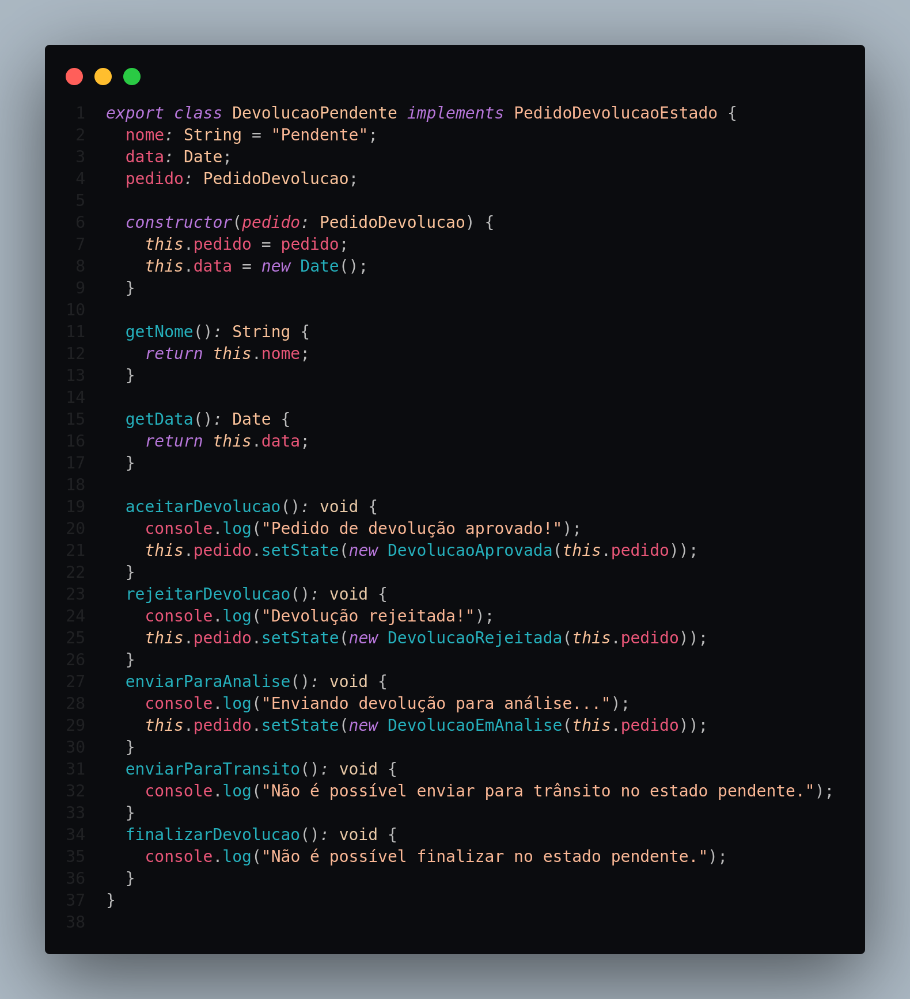

<figcaption style="text-align: center">
   <b>Autor: Elaboração Própria (Samuel Gomes e Gabriel Ferreira)</b>
</figcaption>

 

A **Figura 11** apresenta a implementação do estado de devolução aprovada.

<figcaption style="text-align: center">
    <b>Figura 11: Implementação do estado de devolução aprovada</b>
</figcaption>

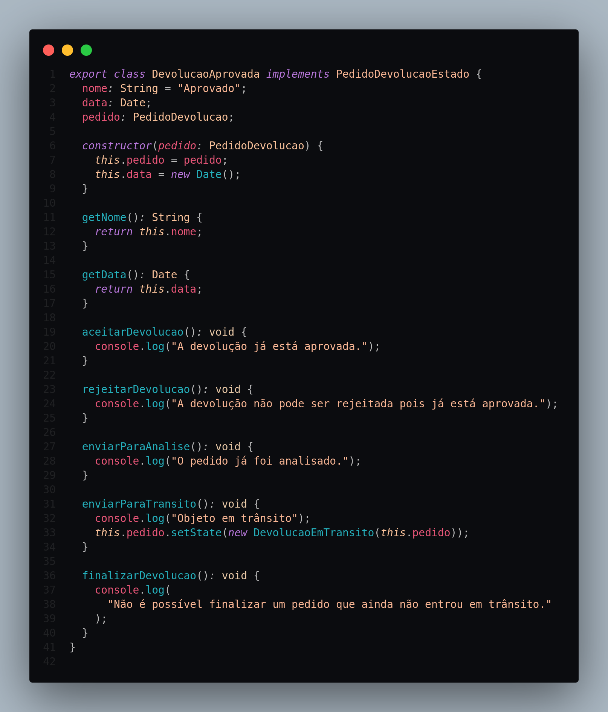

<figcaption style="text-align: center">
   <b>Autor: Elaboração Própria (Samuel Gomes e Gabriel Ferreira)</b>
</figcaption>

 

A **Figura 12** apresenta a implementação do estado de devolução rejeitada.

<figcaption style="text-align: center">
    <b>Figura 12: Implementação do estado de devolução rejeitada</b>
</figcaption>

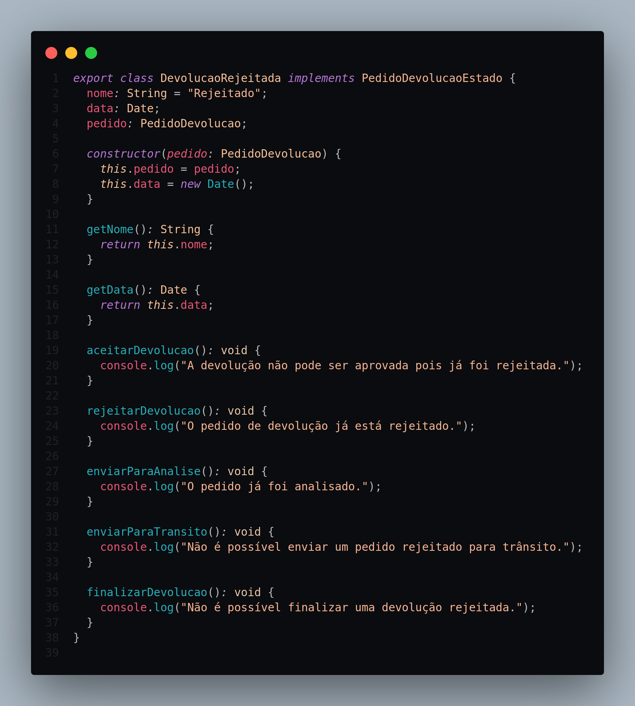

<figcaption style="text-align: center">
   <b>Autor: Elaboração Própria (Samuel Gomes e Gabriel Ferreira)</b>
</figcaption>

 

A **Figura 13** apresenta a implementação do estado de devolução em análise.

<figcaption style="text-align: center">
    <b>Figura 13: Implementação do estado de devolução em análise</b>
</figcaption>

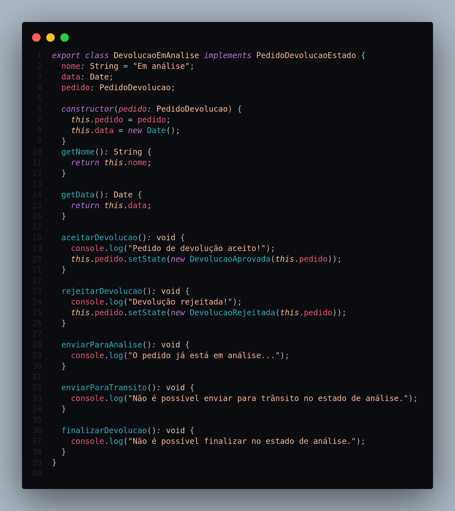

<figcaption style="text-align: center">
   <b>Autor: Elaboração Própria (Samuel Gomes e Gabriel Ferreira)</b>
</figcaption>

 

A **Figura 14** apresenta a implementação do estado de devolução em trânsito.

<figcaption style="text-align: center">
    <b>Figura 14: Implementação do estado de pedido em trânsito</b>
</figcaption>

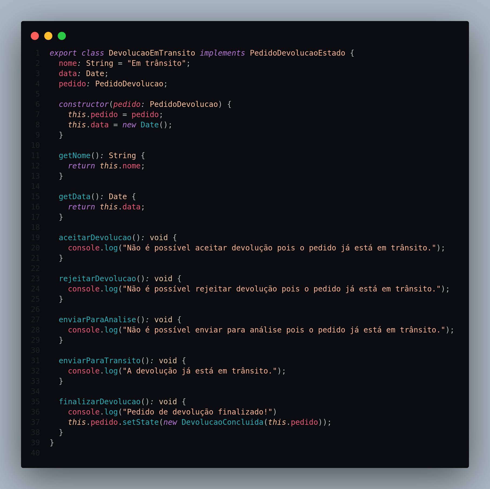

<figcaption style="text-align: center">
   <b>Autor: Elaboração Própria (Samuel Gomes e Gabriel Ferreira)</b>
</figcaption>

 

A **Figura 15** apresenta a implementação do estado de devolução concluída.

<figcaption style="text-align: center">
    <b>Figura 15: Implementação do estado de devolução concluída</b>
</figcaption>

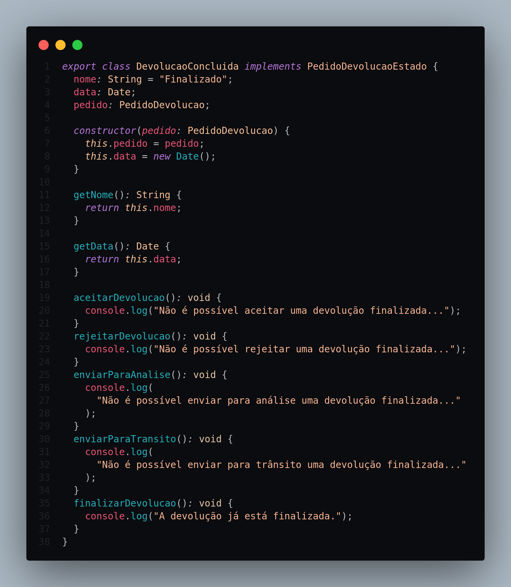

<figcaption style="text-align: center">
   <b>Autor: Elaboração Própria (Samuel Gomes e Gabriel Ferreira)</b>
</figcaption>

 

Na **Figura 16**, o código ilustra as alterações de estado do objeto "pedido_devolucao".

<figcaption style="text-align: center">
    <b>Figura 16: Implementação do estado de devolução concluída</b>
</figcaption>

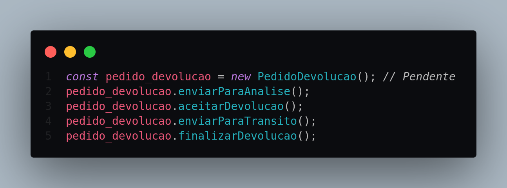

<figcaption style="text-align: center">
   <b>Autor: Elaboração Própria (Samuel Gomes e Gabriel Ferreira)</b>
</figcaption>

## Envio de Anexo - Decorator

O Decorator é um padrão de design estrutural que permite adicionar comportamentos adicionais ou responsabilidades a objetos de forma dinâmica. Ele permite estender as funcionalidades de um objeto sem modificar sua estrutura. Isso é alcançado por meio da criação de uma classe de decorador que envolve o objeto original, adicionando novos comportamentos ao objeto sem alterar sua implementação.

Ao usar o Decorator, é possível criar uma série de pequenos e simples objetos decoradores que podem ser combinados de várias maneiras para adicionar funcionalidades específicas a um objeto base. Isso facilita a reutilização, pois cada decorador pode ser reutilizado individualmente em diferentes contextos e combinado de maneiras diversas para criar novos comportamentos sem precisar modificar o código existente. Essa abordagem modular e flexível oferece maior adaptabilidade e extensibilidade ao software, tornando mais fácil adicionar ou remover funcionalidades, garantindo assim um alto nível de reutilização e manutenção do código.

A estrutura de um Decorator consiste em um Componente que define a interface base, um Decorator que mantém uma referência para o Componente e implementa a mesma interface, um Concrete Component que é a implementação concreta do Componente e um ou mais Concrete Decorators que estendem o Decorator base adicionando funcionalidades adicionais ao Componente. O Componente define a base, enquanto o Decorator e seus derivados oferecem a flexibilidade de adicionar dinamicamente novas responsabilidades aos objetos existentes sem alterar sua estrutura fundamental, permitindo a composição flexível de funcionalidades.

Por meio dessa estrutura, é possível agregar comportamentos adicionais a objetos existentes de maneira modular e dinâmica. O Decorator atua como uma camada flexível que pode ser combinada e empilhada para adicionar funcionalidades de forma individual e reutilizável, maximizando a flexibilidade e promovendo a reutilização de código ao permitir a criação de diferentes combinações de comportamentos.

<figcaption style="text-align: center">
    <b>Figura 7: Diagrama Envio de Anexo</b>
</figcaption>

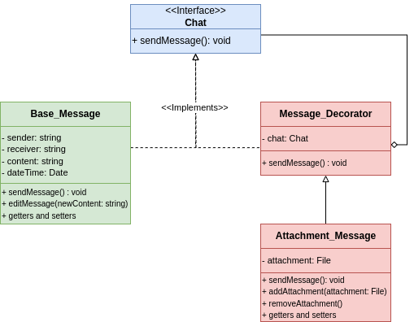

<figcaption style="text-align: center">
   <b>Autor: Elaboração Própria (Henrique Pucci e Pedro Helias)</b>
</figcaption>

A interface Message define um contrato para objetos que podem enviar mensagens, exigindo que qualquer classe que a implemente contenha um método chamado sendMessage sem retorno. Essa interface serve como um contrato padrão, permitindo que diferentes tipos de mensagens, como texto simples ou mensagens com funcionalidades adicionais, sejam tratadas de maneira uniforme, garantindo a capacidade de enviar mensagens independentemente de suas implementações específicas.

<figcaption style="text-align: center">
    <b>Figura 8: Interface de Mensagem</b>
</figcaption>

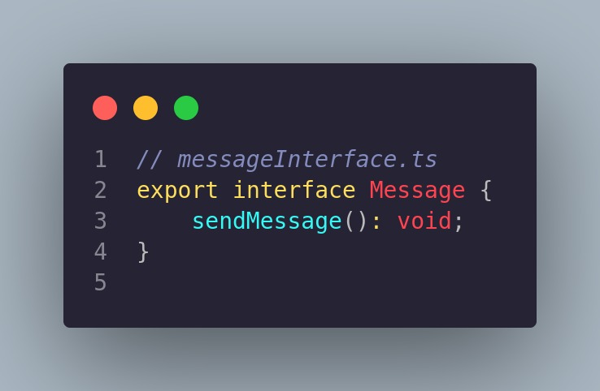

<figcaption style="text-align: center">
   <b>Autor: Elaboração Própria (Henrique Pucci e Pedro Helias)</b>
</figcaption>

A classe Base_Message implementa a interface Message, representando a estrutura fundamental de uma mensagem comum, contendo informações como remetente, destinatário, conteúdo e data/hora do envio. Ela fornece um método sendMessage() que exibe no console os detalhes da mensagem, incluindo a data, remetente, destinatário e conteúdo, permitindo o envio de mensagens básicas. Essa classe serve como a base para outros tipos de mensagens que podem estender ou decorar suas funcionalidades, mantendo uma estrutura consistente para o envio de mensagens.

<figcaption style="text-align: center">
    <b>Figura 9: Classe da Mensagem Base</b>
</figcaption>

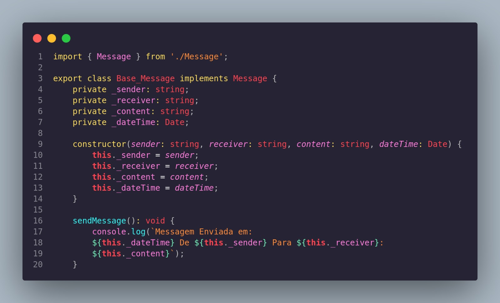

<figcaption style="text-align: center">
   <b>Autor: Elaboração Própria (Henrique Pucci e Pedro Helias)</b>
</figcaption>

A classe Message_Decorator implementa a interface Message, atuando como um decorador que envolve objetos do tipo Message. Ela recebe uma mensagem como parâmetro em seu construtor e, ao chamar o método sendMessage(), repassa essa chamada à mensagem original. Essa classe é fundamental para o padrão Decorator, pois permite adicionar comportamentos adicionais dinamicamente a objetos existentes, sem modificar sua estrutura, facilitando a composição flexível de funcionalidades extras às mensagens.

<figcaption style="text-align: center">
    <b>Figura 10: Classe do Decorador da Mensagem</b>
</figcaption>

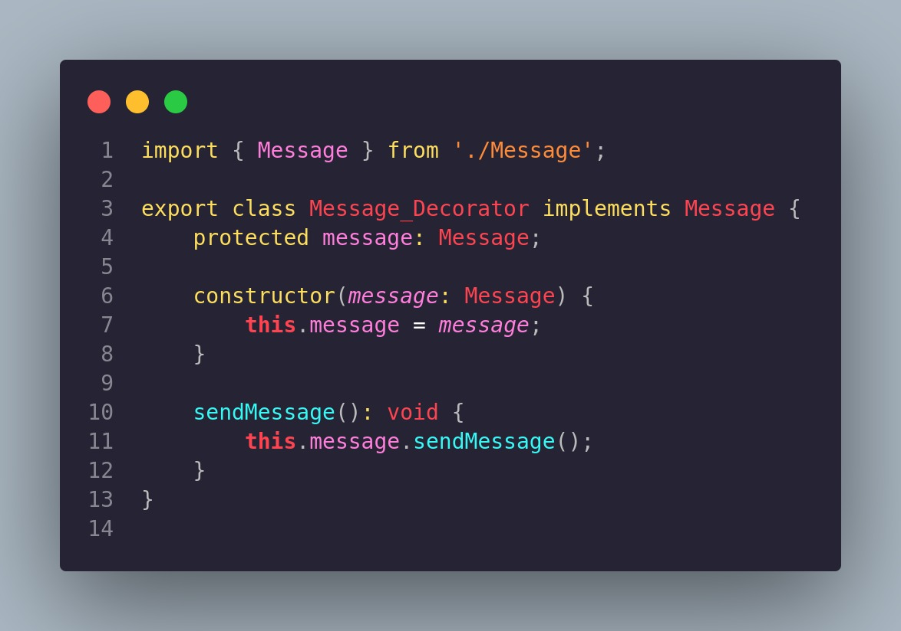

<figcaption style="text-align: center">
   <b>Autor: Elaboração Própria (Henrique Pucci e Pedro Helias)</b>
</figcaption>

A classe Attachment_Message estende a classe Message_Decorator e implementa a interface Message. Essa classe representa um tipo de mensagem decorada que permite adicionar anexos a uma mensagem existente. Ela recebe uma mensagem base, um nome de anexo e o conteúdo do anexo em seu construtor. Ao chamar o método sendMessage(), além de repassar a chamada à mensagem original, exibe no console os detalhes do anexo adicionado, incluindo o nome e o conteúdo. Essa classe é essencial para a adição dinâmica de funcionalidades extras às mensagens, como a inclusão de anexos, sem modificar a estrutura original da mensagem.

<figcaption style="text-align: center">
    <b>Figura 10: Classe da Implementação do Anexo em mensagem</b>
</figcaption>

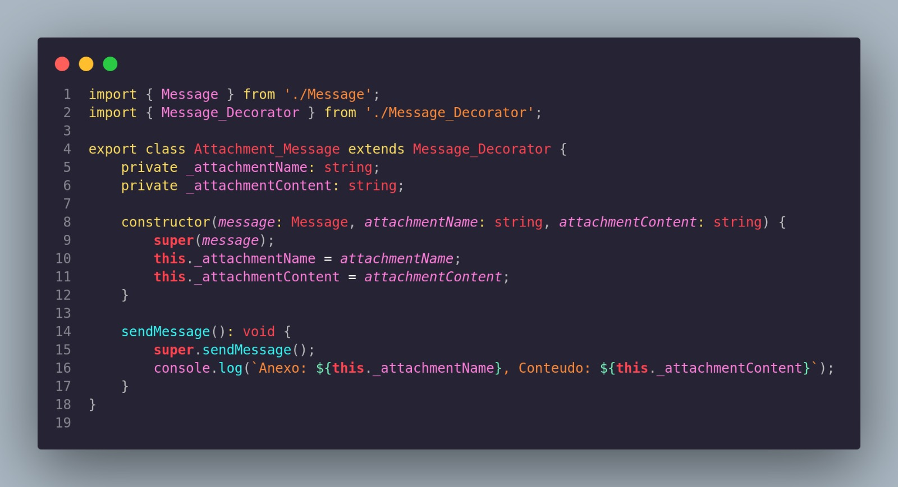

<figcaption style="text-align: center">
   <b>Autor: Elaboração Própria (Henrique Pucci e Pedro Helias)</b>
</figcaption>

Na classe Main, a primeira parte faz o envio de uma mensagem simples, sem anexo, usando a classe Base_Message. A segunda parte ilustra a criação de uma mensagem com a possibilidade de anexo, inicialmente utilizando a classe Base_Message e, em seguida, acrescentando um decorador com a classe Message_Decorator e um anexo com a classe Attachment_Message. Ambos os cenários são utilizados para mostrar a funcionalidade de envio de mensagens, exibindo o funcionamento das mensagens sem e com anexo.

<figcaption style="text-align: center">
    <b>Figura 10: Classe main</b>
</figcaption>

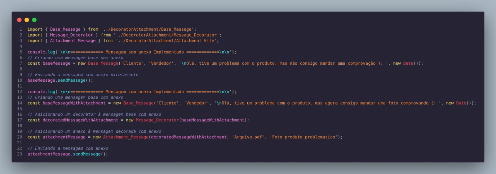

<figcaption style="text-align: center">
   <b>Autor: Elaboração Própria (Henrique Pucci e Pedro Helias)</b>
</figcaption>

## Notificação - Observer

## Introdução

O padrão de design Observer, ou Observador em português, pertence à categoria de padrões comportamentais e é projetado para fornecer uma maneira eficiente de um objeto comunicar mudanças de estado para seus observadores de forma desacoplada.

A ideia principal por trás do padrão Observer é estabelecer uma relação de dependência um para muitos entre um objeto chamado "sujeito" e vários objetos chamados "observadores". Quando o estado do sujeito muda, todos os observadores são notificados automaticamente e atualizados de acordo.

Esse padrão é valioso em cenários nos quais a alteração de um objeto requer a atualização de outros objetos sem que haja uma dependência direta entre eles. Ele promove um baixo acoplamento, uma vez que os observadores não precisam conhecer detalhes internos do sujeito, apenas se inscrevem para receber notificações sobre mudanças relevantes.

Diante do conceito previamente exposto, optamos por empregar o padrão Observer na implementação de um módulo de notificação. Este módulo tem como finalidade informar os clientes da Amazon sobre o status atualizado do processo de devolução realizado pela transportadora. 

## Metodologia

A solução foi construída usando como referência as aulas da professora e a bibliografia que consta no documento, onde nos reunimos de forma remota e após concluirmos que o sistema de notificação seria o escolhido, foi verificado qual solução resolveria o problema da melhor forma possível, desse modo chegamos no Observer. 

A partir dai, elaboramos um diagrama de classes para representar de forma gráfica e padronizada a solução e depois implementamos no TypeScript o código referente a modelagem previamente feita.

## Observer

### Diagrama UML
A Figura 11 expõe o diagrama feito para construir a implementação do Observer. Nele é possível observar as interfaces Observable e Observer usadas para aplicar o design. Entao temos a classe transportadora que possui uma lista de Observer, a classe abstrata Pessoa e por fim a classe Cliente que implementa Observer e é filha de Pessoa.

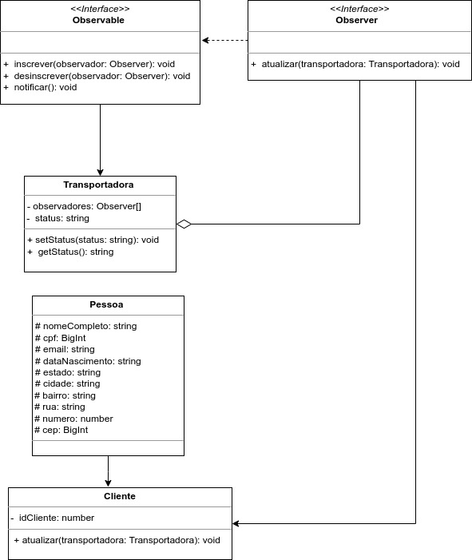

<figcaption style="text-align: center">
    <b>Figura 11: Diagrama UML</b>
</figcaption>

### Código Implementado

O código da Figura 12 define uma interface chamada Observer em TypeScript. Essa interface tem um método chamado atualizar que espera receber um objeto do tipo Transportadora.

<figcaption style="text-align: center">
    <b>Figura 12: Interface Observer</b>
</figcaption>

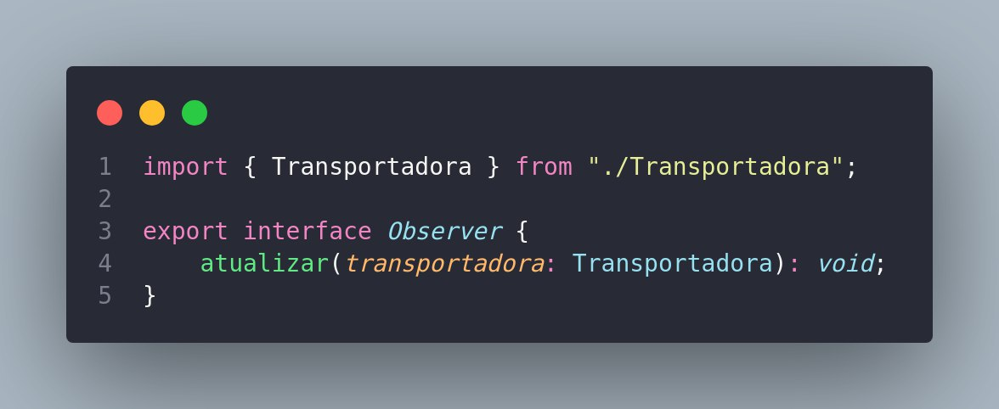

O código da Figura 13 define uma interface chamada Observable. Essa interface representa um objeto que é observável, ou seja, pode ser monitorado por outros objetos (observadores). A interface possui três métodos:

inscrever(observador: Observer): void: Adiciona um observador à lista de observadores interessados no objeto observável.

desinscrever(observador: Observer): void: Remove um observador da lista de observadores.

notificar(): void: Informa a todos os observadores registrados sobre alguma mudança ou evento no objeto observável.

<figcaption style="text-align: center">
    <b>Figura 13: Interface Observable</b>
</figcaption>

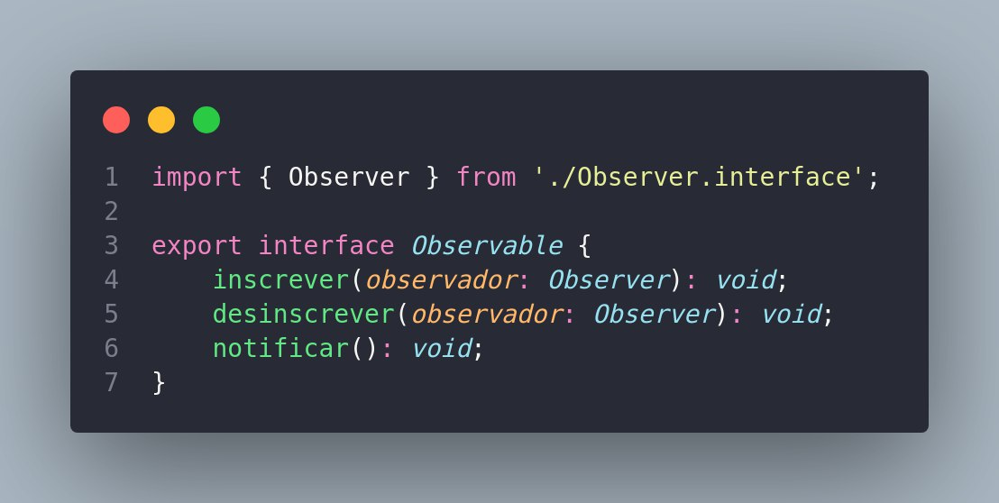

O código da Figura 14 define uma classe chamada Pessoa que representa uma entidade com informações pessoais. A classe tem propriedades como nome completo, CPF, email, data de nascimento, endereço (estado, cidade, bairro, rua, número e CEP). O construtor da classe é utilizado para inicializar essas propriedades com os valores passados como parâmetros. Em resumo, a classe Pessoa serve para criar objetos que contêm informações pessoais de uma pessoa.

<figcaption style="text-align: center">
    <b>Figura 14: Classe Pessoa</b>
</figcaption>

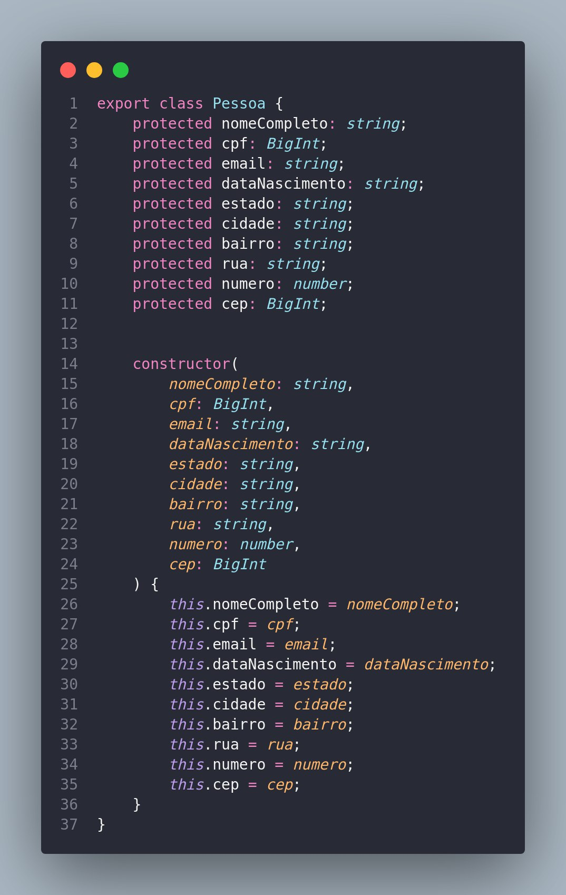

O código da Figura 15 define uma classe chamada Cliente que estende a classe Pessoa e implementa a interface Observer. A classe Cliente representa um cliente que possui informações pessoais (herdadas da classe Pessoa). Além disso, a classe cliente tem um identificador único (idCliente).

O método atualizar da interface Observer é implementado na classe Cliente, o que significa que um objeto da classe Cliente pode ser notificado sobre atualizações de uma instância da classe Transportadora. Quando notificado, o cliente imprime no console uma mensagem indicando o nome do cliente e a nova atualização de status da transportadora.

<figcaption style="text-align: center">
    <b>Figura 15: Classe Cliente</b>
</figcaption>

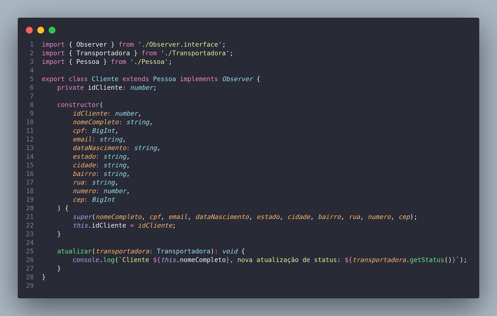

O código da Figura 16 define uma classe chamada Transportadora que implementa a interface Observable. A classe Transportadora representa uma entidade que pode ser observada por outros objetos que implementam a interface Observer.

A classe mantém uma lista de observadores (observadores) e um status. Ela fornece métodos para:

inscrever(observador: Observer): void: Adiciona um observador à lista, verificando se já está inscrito.

desinscrever(observador: Observer): void: Remove um observador da lista.

notificar(): void: Notifica todos os observadores sobre uma mudança, chamando o método atualizar em cada observador.

setStatus(status: string): void: Define o status da transportadora e notifica os observadores sobre a mudança.

getStatus(): string: Retorna o status atual da transportadora.

<figcaption style="text-align: center">
    <b>Figura 16: Classe Transportadora</b>
</figcaption>

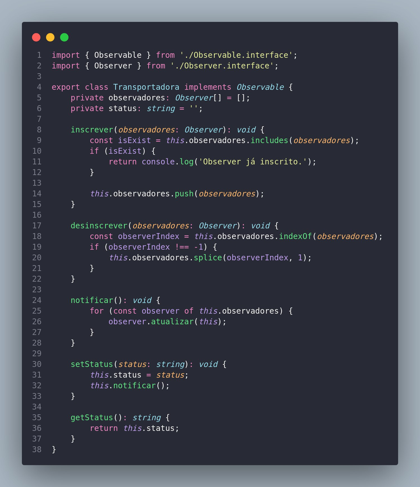

O código da Figura 17 cria instâncias de uma Transportadora e dois Clientes. Em seguida, ele inscreve os clientes na transportadora como observadores. Posteriormente, o código define diferentes estados ("Pacote enviado!", "Pacote em trânsito!", "Pacote entregue!") para a transportadora, notificando assim os clientes sobre essas mudanças de status.

Após algumas atualizações de status, o primeiro cliente (cliente1) é removido da lista de observadores (desinscrito). Em seguida, a transportadora define um novo status ("Pacote devolvido!"), mas apenas o segundo cliente (cliente2) recebe a notificação, pois o primeiro cliente já não está mais inscrito.

<figcaption style="text-align: center">
    <b>Figura 17: Main</b>
</figcaption>

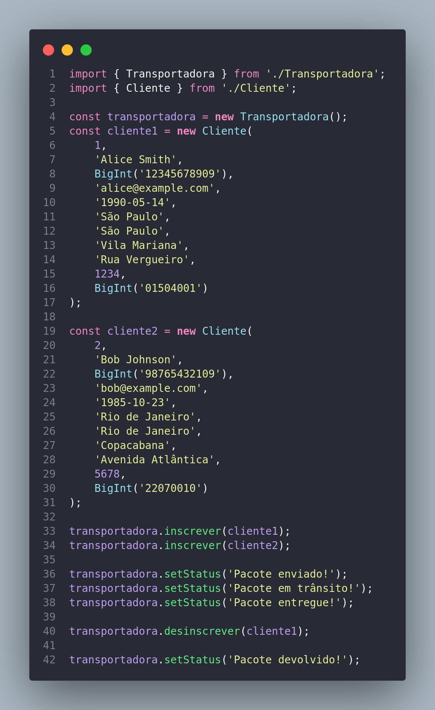

## Validação de Dados - Template Method

O Template Method é um padrão de design comportamental que define a estrutura de um algoritmo, permitindo que partes de seu comportamento sejam alteradas por subclasses sem alterar a estrutura geral.

A ideia básica por trás do Template Method é fornecer um esqueleto de algoritmo em uma classe base, com certas etapas marcadas como "métodos abstratos" que devem ser implementados pelas subclasses. Esses métodos abstratos representam variações específicas de uma etapa do algoritmo, permitindo que as subclasses personalizem partes específicas do comportamento sem reescrever o algoritmo inteiro.

O padrão Template Method é frequentemente usado em situações em que há um algoritmo comum que precisa ser aplicado, mas existem variações específicas nas etapas desse algoritmo. Ele é útil quando você deseja evitar a duplicação de código, fornecendo uma estrutura comum e permitindo que partes específicas do algoritmo sejam implementadas por subclasses.

Na figura 18 segue o diagrama do template method no contexto de validação de dados no processo de devolução de um produto no site da Amazon.

<figcaption style="text-align: center">
    <b>Figura 18: Diagrama </b>
</figcaption>

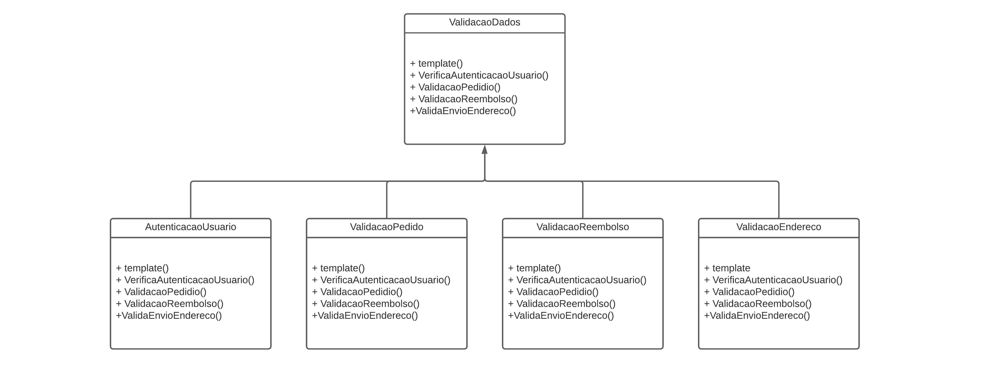

<figcaption style="text-align: center">
   <b>Autor: Elaboração Própria (Artur Vinicius e Mateus de Almeida)</b>
</figcaption>

Uma classe abstrata é uma classe que não pode ser instanciada diretamente e geralmente é usada como uma base para outras classes. Ela é projetada para ser estendida por subclasses que implementam ou fornecem implementações concretas para seus métodos abstratos.

<figcaption style="text-align: center">
    <b>Figura 19: Classe Abstrata </b>
</figcaption>

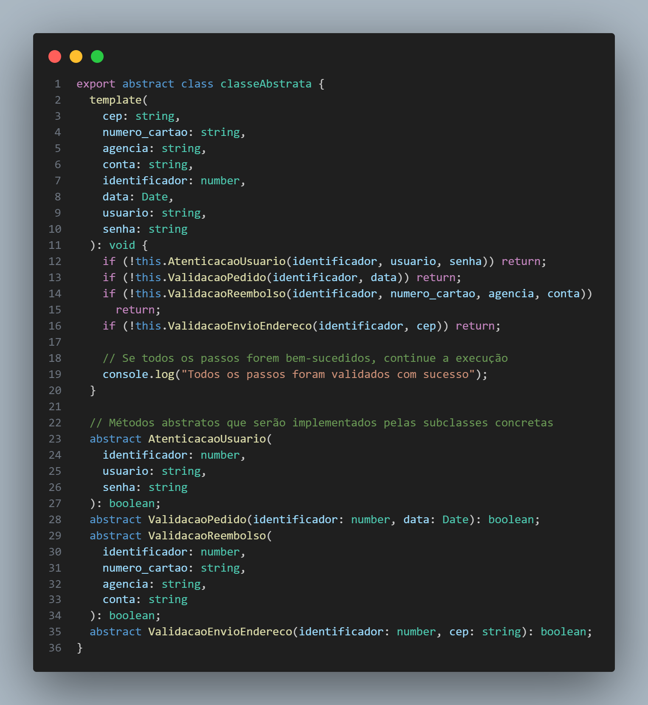

<figcaption style="text-align: center">
   <b>Autor: Elaboração Própria (Artur Vinicius e Mateus de Almeida)</b>
</figcaption>

Uma classe concreta é uma classe que pode ser instanciada diretamente, ao contrário de uma classe abstrata. Em uma classe concreta, todos os métodos abstratos da classe base (se houver) são implementados, e a classe pode ser usada para criar objetos.

<figcaption style="text-align: center">
    <b>Figura 20: Classe Concreta </b>
</figcaption>

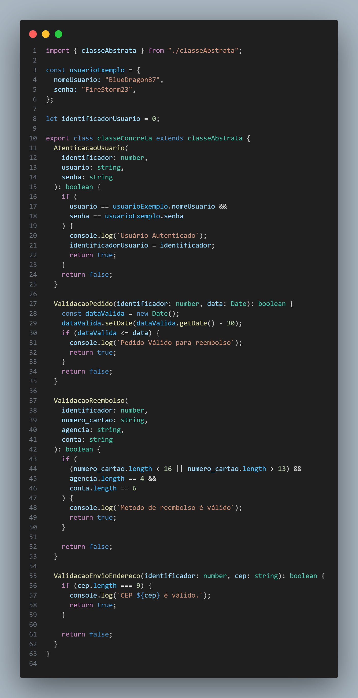

<figcaption style="text-align: center">
   <b>Autor: Elaboração Própria (Artur Vinicius e Mateus de Almeida)</b>
</figcaption>

A Main para executar instanciar as classes e testar a os métodos desenvolvidos na classeconcreta.

<figcaption style="text-align: center">
    <b>Figura 21: Main </b>
</figcaption>

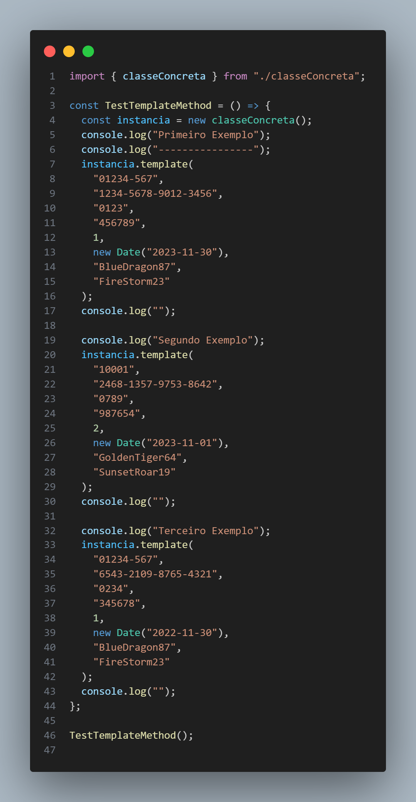

<figcaption style="text-align: center">
   <b>Autor: Elaboração Própria (Artur Vinicius e Mateus de Almeida)</b>
</figcaption>

