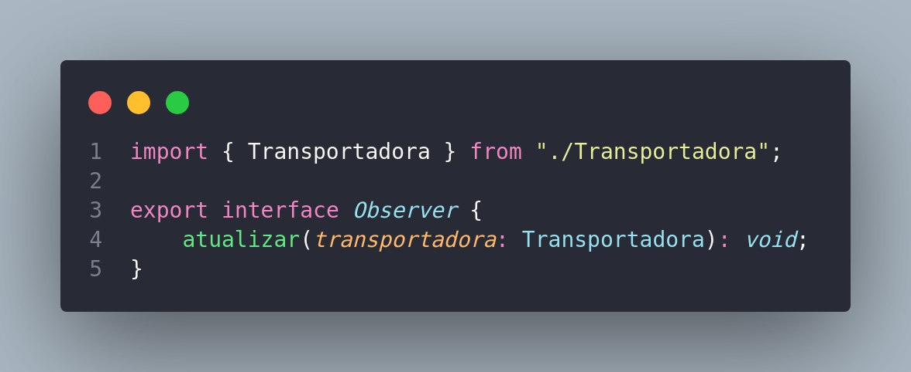
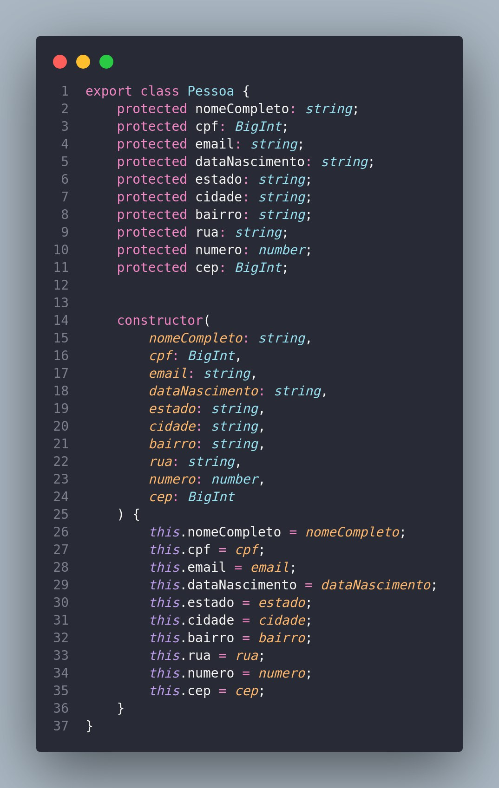
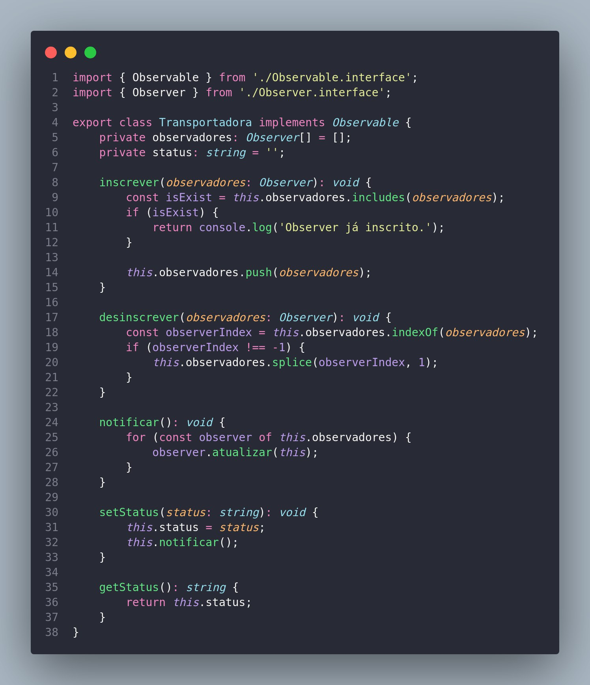

# Notificação - Observer

## Introdução

O padrão de design Observer, ou Observador em português, pertence à categoria de padrões comportamentais e é projetado para fornecer uma maneira eficiente de um objeto comunicar mudanças de estado para seus observadores de forma desacoplada.

A ideia principal por trás do padrão Observer é estabelecer uma relação de dependência um para muitos entre um objeto chamado "sujeito" e vários objetos chamados "observadores". Quando o estado do sujeito muda, todos os observadores são notificados automaticamente e atualizados de acordo.

Esse padrão é valioso em cenários nos quais a alteração de um objeto requer a atualização de outros objetos sem que haja uma dependência direta entre eles. Ele promove um baixo acoplamento, uma vez que os observadores não precisam conhecer detalhes internos do sujeito, apenas se inscrevem para receber notificações sobre mudanças relevantes.

Diante do conceito previamente exposto, optamos por empregar o padrão Observer na implementação de um módulo de notificação. Este módulo tem como finalidade informar os clientes da Amazon sobre o status atualizado do processo de devolução realizado pela transportadora. 

## Metodologia

## Observer

### Diagrama UML

### Código Implementado

O código da Figura 1 define uma interface chamada Observer em TypeScript. Essa interface tem um método chamado atualizar que espera receber um objeto do tipo Transportadora.

<figcaption style="text-align: center">
    <b>Figura 1: Interface Observer</b>
</figcaption>

O código da Figura 2 define uma interface chamada Observable. Essa interface representa um objeto que é observável, ou seja, pode ser monitorado por outros objetos (observadores). A interface possui três métodos:

inscrever(observador: Observer): void: Adiciona um observador à lista de observadores interessados no objeto observável.

desinscrever(observador: Observer): void: Remove um observador da lista de observadores.

notificar(): void: Informa a todos os observadores registrados sobre alguma mudança ou evento no objeto observável.

<figcaption style="text-align: center">
    <b>Figura 2: Interface Observable</b>
</figcaption>

O código da Figura 3 define uma classe chamada Pessoa que representa uma entidade com informações pessoais. A classe tem propriedades como nome completo, CPF, email, data de nascimento, endereço (estado, cidade, bairro, rua, número e CEP). O construtor da classe é utilizado para inicializar essas propriedades com os valores passados como parâmetros. Em resumo, a classe Pessoa serve para criar objetos que contêm informações pessoais de uma pessoa.

<figcaption style="text-align: center">
    <b>Figura 3: Classe Pessoa</b>
</figcaption>

O código da Figura 4 define uma classe chamada Cliente que estende a classe Pessoa e implementa a interface Observer. A classe Cliente representa um cliente que possui informações pessoais (herdadas da classe Pessoa). Além disso, a classe cliente tem um identificador único (idCliente).

O método atualizar da interface Observer é implementado na classe Cliente, o que significa que um objeto da classe Cliente pode ser notificado sobre atualizações de uma instância da classe Transportadora. Quando notificado, o cliente imprime no console uma mensagem indicando o nome do cliente e a nova atualização de status da transportadora.

<figcaption style="text-align: center">
    <b>Figura 4: Classe Cliente</b>
</figcaption>

O código da Figura 5 define uma classe chamada Transportadora que implementa a interface Observable. A classe Transportadora representa uma entidade que pode ser observada por outros objetos que implementam a interface Observer.

A classe mantém uma lista de observadores (observadores) e um status. Ela fornece métodos para:

inscrever(observador: Observer): void: Adiciona um observador à lista, verificando se já está inscrito.

desinscrever(observador: Observer): void: Remove um observador da lista.

notificar(): void: Notifica todos os observadores sobre uma mudança, chamando o método atualizar em cada observador.

setStatus(status: string): void: Define o status da transportadora e notifica os observadores sobre a mudança.

getStatus(): string: Retorna o status atual da transportadora.

<figcaption style="text-align: center">
    <b>Figura 5: Classe Transportadora</b>
</figcaption>

O código da Figura 6 cria instâncias de uma Transportadora e dois Clientes. Em seguida, ele inscreve os clientes na transportadora como observadores. Posteriormente, o código define diferentes estados ("Pacote enviado!", "Pacote em trânsito!", "Pacote entregue!") para a transportadora, notificando assim os clientes sobre essas mudanças de status.

Após algumas atualizações de status, o primeiro cliente (cliente1) é removido da lista de observadores (desinscrito). Em seguida, a transportadora define um novo status ("Pacote devolvido!"), mas apenas o segundo cliente (cliente2) recebe a notificação, pois o primeiro cliente já não está mais inscrito.

<figcaption style="text-align: center">
    <b>Figura 6: Main</b>
</figcaption>

