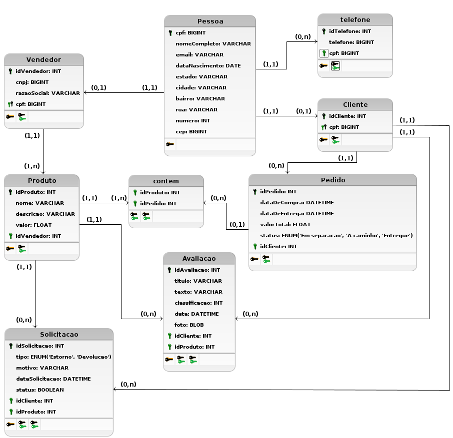

# Protótipo de Alta Fidelidade

## Introdução

A visão de dados em um documento de arquitetura de software refere-se à representação estruturada e organizada dos requisitos e elementos relacionados ao gerenciamento de dados dentro de um sistema. Ela fornece uma visão abrangente das entidades de dados, suas interações e os fluxos de informação no contexto da arquitetura geral do software. Essa visão é crucial para compreender como os dados são coletados, armazenados, processados e acessados no sistema, permitindo aos arquitetos de software tomar decisões informadas sobre a escolha de tecnologias de armazenamento, estratégias de acesso aos dados e garantir a integridade e eficiência do sistema no que diz respeito à manipulação de informações. Em suma, a visão de dados facilita a compreensão e o planejamento eficaz da gestão de dados em um ambiente de software.

## Metodologia

As versões dos diagramas apresentados na sessão seguinte foram elaborados utilizando a ferramenta de modelagem <a href="http://www.sis4.com/brModelo/download.html">brModelo</a> e desenvolvidos, inicialmente, a partir do <a href="https://unbarqdsw2023-2.github.io/2023.2_G3_ProjetoAmazon/#/Modelagem/diagramasEstaticos/diagramaClasses">diagrama de classes</a>. Posteriormente, os diagramas foram alterados e melhorados a partir de discussões em grupo, para que se chegasse em uma modelagem ideal.

Por fim, também a partir de discussões em grupo, foi decidido utilizar o Sistema Gerenciador de Banco de Dados Relacional <a href="https://www.postgresql.org/">PostgreSQL</a>. O PostgreSQL é uma boa escolha para esse projeto devido à sua robustez, extensibilidade, suporte a SQL avançado, integridade referencial, escalabilidade e licença open source que promove a flexibilidade e reduz custos.

## Diagramas

### Versão 1.0

Diagrama Entidade-Relacionamento (DER)

<figcaption style="text-align: center">Figura 1: DER versão 1.0 (Fonte: Autor, 2023).</figcaption>

Diagrama Lógico de Dados (DLD)

<figcaption style="text-align: center">Figura 2: DLD versão 1.0 (Fonte: Autor, 2023).</figcaption>

### Versão 1.1

Diagrama Entidade-Relacionamento (DER)

<figcaption style="text-align: center">Figura 3: DER versão 1.1 (Fonte: Autor, 2023).</figcaption>

Diagrama Lógico de Dados (DLD)

<figcaption style="text-align: center">Figura 4: DLD versão 1.1 (Fonte: Autor, 2023).</figcaption>

## Bibliografia
> Arquitetura e Desenho de Software - Aulas de ARQUITETURA & DAS - Prof. Milene

> Guia Completa de PostgreSQL: PostgreSQL do Básico ao Avançado.  Disponível em: <https://www.devmedia.com.br/guia/tecnologia-postgresql/34328>. Acesso em: 25 nov. 2023.

## Histórico de versão
| Versão | Data | Descrição | Autor | Revisor |
| :----: | :--: | :-------: | :---: | :-----: |
| 1.0 | 25/11/2023 | Criação inicial do documento | Lucas Rocha e Lucas Frazão | Artur Vinicius |
