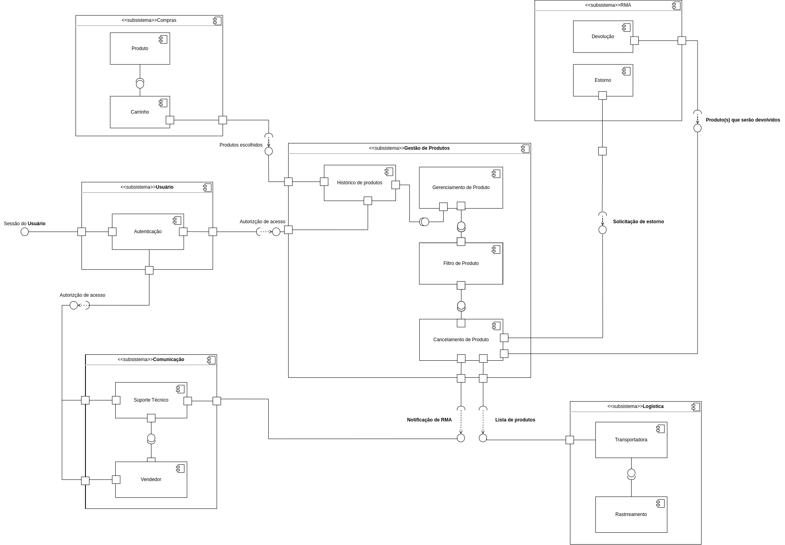

# Visão de Implementação

## Diagrama de Componentes

À seguir, na <i> Figura 1</i>, estará representado o diagrama de componentes proposto pelo grupo, utilizando-se das técnicas de UML em sua formação.

<figcaption style="text-align: center">
    <b>Figura 1: Diagrama de Componentes (UML)</b>
</figcaption>

<figcaption style="text-align: center">
   <b>Autor: Elaboração Própria (Henrique Pucci, Chaydson Ferreira)</b>
</figcaption>

## Componentes

## Relacionamentos e dependências

## Referências

- Diagrama de componentes UML: o que é, como fazer e exemplos. Disponível em: <https://www.lucidchart.com/pages/pt/diagrama-de-componentes-uml>. Acesso em: 30 nov. 2023.

- UML Component Diagrams. Disponível em: <https://www.uml-diagrams.org/component-diagrams.html>. Acesso em: 30 nov. 2023.

- The Unified Modeling Language. Disponível em: <https://www.uml-diagrams.org/>. Acesso em: 30 nov. 2023.

## Histórico de versão

| Versão |    Data    |          Descrição           |                            Autor                            |                                  Revisor                                  |
| :----: | :--------: | :--------------------------: | :---------------------------------------------------------: | :-----------------------------------------------------------------------: |
|  1.0   | 30/11/2023 | Criação inicial do documento | Henrique Pucci, Chaydson Fereira|  |