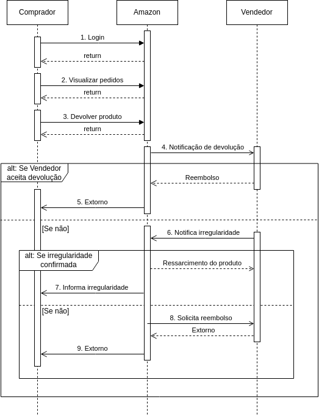

# Visão de Processos

## Introdução

Na documentação de um projeto de software, a Visão de Processos busca documentar e descrever processos utilizados, atividades, fluxos de trabalho, metodologias, evolução do software, entre outros pontos. Sua construção é capaz de descrever como diferentes partes/setores, correspondentes ao projeto, colaboram para atingir os objetivos determinados. A visão correspondentemente "macro" de uma organização tende a simplificar e facilitar o entendimento a respeito das relações entre as partes que compõe o projeto.

Na elaboração da Visão de Processos, deve se considerar os componentes, que compõe o ecossistema dos processos. Por sua vez, os processos determinam quais componentes serão executados. A comunicação também deve ser considerada, uma vez que a forma e o protocolo utilizado são de elevada importância. Há questões de segurança atreladas na comunicação. É importante também buscar o sincronismo entre essas partes. 

A visão de processos traz alguns beneicios, como: Organização e maior entendimento a respeito dos processos adotados, como os mesmos acontecem, e como a relação entre as partes ocorre; agilidade na execução das atividades; simplifica mais ainda o processo de buscas por gargalos, entre outros. 

## Diagramação

Para representar o modelo documental, utiliza-se um outro modelo mais visual, na forma de diagrama, denominado por Diagrama de Sequência. Este documento pode ser utilizado para representar como diferentes partes de um sistema de encaixam/conectam e como trabalham juntas, mas em forma de diagrama. 

Para este projeto, foi elaborado um Diagrama de Sequência com o intuito de esclarecer as relações dentro do fluxo selecionado para o grupo, além de seus componentes internos e os relacionamentos entre sistemas. 

## Tabela de símbolos 

A simbologia para construção do diagrama respeita a legenda encontrada na tabela abaixo. Os mais comuns estão descritos.

<figcaption style="text-align: center">
    <b>Figura 1: Tabela de Símbolos</b>
</figcaption>

<figcaption style="text-align: center">
   <b>Autor: Elaboração Própria (Pedro Helias)</b>
</figcaption>

## Diagrama de Sequência

<figcaption style="text-align: center">
    <b>Figura 2: Diagrama de Sequência</b>
</figcaption>

<figcaption style="text-align: center">
   <b>Autor: Elaboração Própria (Chaydson Ferreira Henrique e Lucas Frazão)</b>
</figcaption>

## Referências

>O que é um diagrama de sequência UML?. Disponível em: <a href="https://www.lucidchart.com/pages/pt/o-que-e-diagrama-de-sequencia-uml"> referência </a>. Acesso em 26 de Novembro de 2023.

>Diagramas de Seqüência. Disponível em: <a href="https://www.ibm.com/docs/pt-br/rsm/7.5.0?topic=uml-sequence-diagrams"> referência </a>. Acesso em 26 de Novembro de 2023.

## Histórico de versão

| Versão |    Data    |             Descrição             |                             Autor                             |                                  Revisor                                  |
| :----: | :--------: | :-------------------------------: | :-----------------------------------------------------------: | :-----------------------------------------------------------------------: |
|  1.0   | 26/11/2023 |   Criação inicial do documento    | Pedro Helias| Gabriel |

