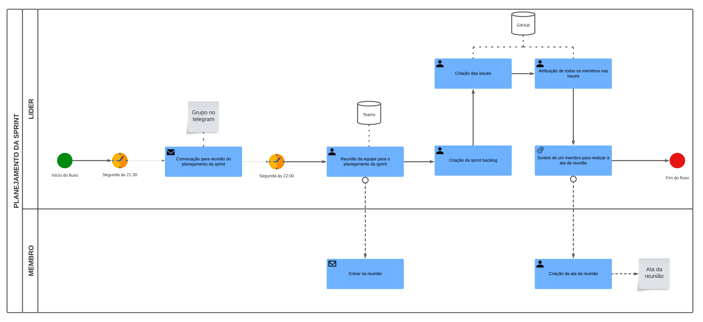
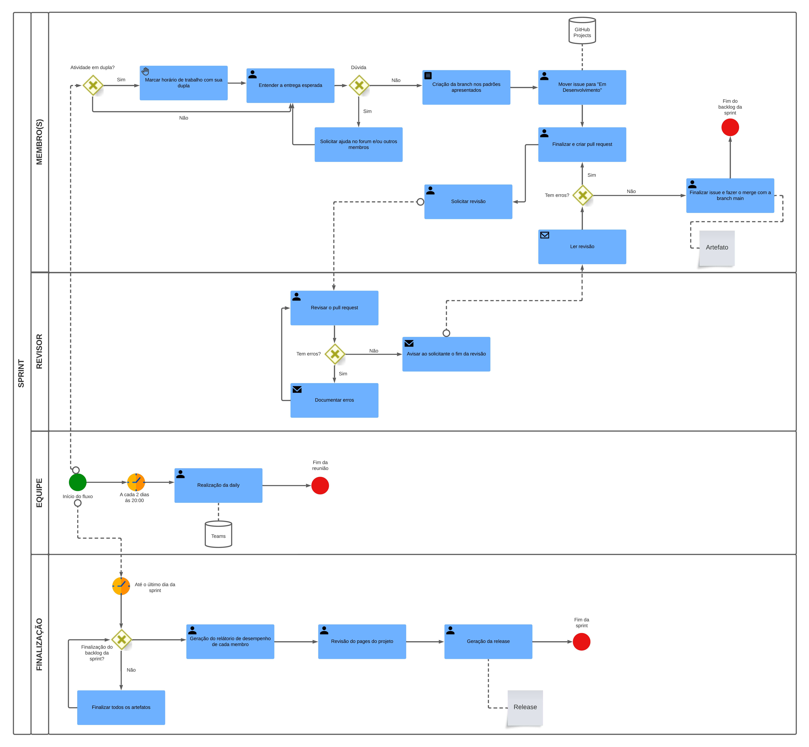
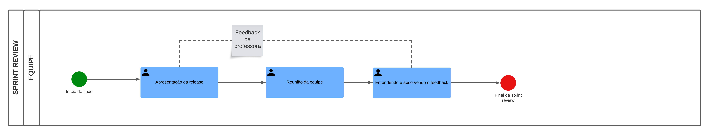

# BPMN

## Introdução

BPMN, ou Business Process Modeling Notation, é uma linguagem de modelação visual utilizada para a análise e a especificação de fluxos de trabalho de processos. Trata-se de uma notação de norma aberta para fluxogramas gráficos que é utilizada para definir fluxos de trabalho de processos. O BPMN fornece uma representação gráfica abrangente e intuitiva que pode ser facilmente compreendida por todos os intervenientes, incluindo utilizadores empresariais, analistas, programadores de software e arquitetos de dados.

Eis alguns pontos-chave sobre o BPMN:

- O BPMN utiliza diagramas com uma série de elementos gráficos para descrever processos. Estas representações visuais facilitam aos utilizadores a compreensão da lógica de um processo.
- O BPMN classifica os elementos gráficos em categorias para os tornar facilmente reconhecíveis. Esta classificação ajuda os utilizadores que trabalham com diagramas de processos a identificar e compreender os elementos.
- O BPMN inclui piscinas, que são caixas retangulares que representam os participantes em algum processo. As piscinas podem ser dispostas horizontal ou verticalmente e ajudam a organizar e visualizar o fluxo do processo.
- O BPMN é a forma padrão de representar processos de negócio e é amplamente utilizada em empresas de todo o mundo.
- O BPMN 2.0 é a versão atual da especificação, que foi lançada em janeiro de 2014.
- Os diagramas BPMN consistem em objectos de fluxo e objectos de ligação. Os objectos de fluxo incluem eventos, actividades e gateways, enquanto os objectos de ligação incluem sequências, mensagens e associações.

## Aplicação

### Planejamento da sprint

Na Figura 1, apresentamos o esquema de planejamento da sprint. Nesta etapa crucial, o líder da equipe assume a responsabilidade de conduzir a reunião de forma eficaz. O foco central da discussão recai sobre as tarefas necessárias para atingirmos o objetivo final da entrega. Neste contexto, elaboramos o backlog da sprint, definimos as "issues" e designamos membros específicos para cada uma delas. Ao concluir a reunião, realizamos um sorteio para determinar quem será responsável pela elaboração da ata.

<figcaption style="text-align: center">
    <b>Figura 1: Diagrama BPMN 2.0 (Planejamento da sprint)</b>
</figcaption>

<figcaption style="text-align: center">
   <b>Autor: Elaboração Própria (Lucas Frazão e Chaydson)</b>
</figcaption>

### Funcionamento da sprint

Na Figura 2, apresentamos uma modelagem BPMN mais sofisticada que envolve múltiplos participantes. Optamos por uma abordagem híbrida que combina elementos das metodologias Extreme Programming (XP) e Scrum. Para otimizar o desenvolvimento, estabelecemos que as "issues" serão tratadas em pares de programadores e instituímos reuniões diárias de alinhamento ("dailys") a cada 48 horas.

Como parte da dinâmica de cada "issue", o membro designado deve primeiro compreender integralmente a demanda em questão. Em seguida, ele deve criar uma "branch" específica para desenvolver a solução. Após a conclusão do desenvolvimento, é criado um Pedido de Pull (PR) e um outro membro da equipe é responsável por revisar o código.

O papel do revisor vai além de apenas verificar o código; ele deve também entender a "issue" e avaliar se a solução proposta está alinhada com os requisitos. Após a revisão bem-sucedida e a aprovação do PR, a "branch" é então mesclada à "main".

Para encerrar o ciclo, geramos dois conjuntos de documentação: um relatório de desempenho individual, que serve para avaliar a eficácia de cada membro da equipe, e a geração da "release", que consolida todas as alterações feitas durante a sprint.

<figcaption style="text-align: center">
    <b>Figura 2: Diagrama BPMN 2.0 (Funcionamento da sprint)</b>
</figcaption>

<figcaption style="text-align: center">
   <b>Autor: Elaboração Própria (Lucas Frazão e Chaydson)</b>
</figcaption>

### Revisão da sprint

Na Figura 3, destacamos uma única "piscina" que ilustra nosso processo básico de análise pós-apresentação à professora. Este fluxo é projetado para permitir que absorvamos de forma eficaz o feedback recebido, com o objetivo de aprimorar nossas futuras entregas. Esse mecanismo nos capacita a identificar e abordar quaisquer aspectos negativos evidenciados na entrega anterior, garantindo um ciclo contínuo de melhoria.

<figcaption style="text-align: center">
    <b>Figura 3: Diagrama BPMN 2.0 (Revisão da sprint)</b>
</figcaption>

<figcaption style="text-align: center">
   <b>Autor: Elaboração Própria (Lucas Frazão e Chaydson)</b>
</figcaption>

## Bibliografia

> What is BPMN? Visual-paradigm.com. Disponível em: <https://www.visual-paradigm.com/guide/bpmn/what-is-bpmn/>. Acesso em: 14 set. 2023.

> Introduction to BPMN Part I. Visual-paradigm.com. Disponível em: <https://www.visual-paradigm.com/tutorials/bpmn1.jsp>. Acesso em: 14 set. 2023.

## Histórico de versão

| Versão |    Data    |          Descrição           |          Autor          |       Revisor        |
| :----: | :--------: | :--------------------------: | :---------------------: | :------------------: |
|  1.0   | 14/09/2023 | Criação inicial do documento | Lucas Frazão e Chaydson | Pedro Helias e Artur |
