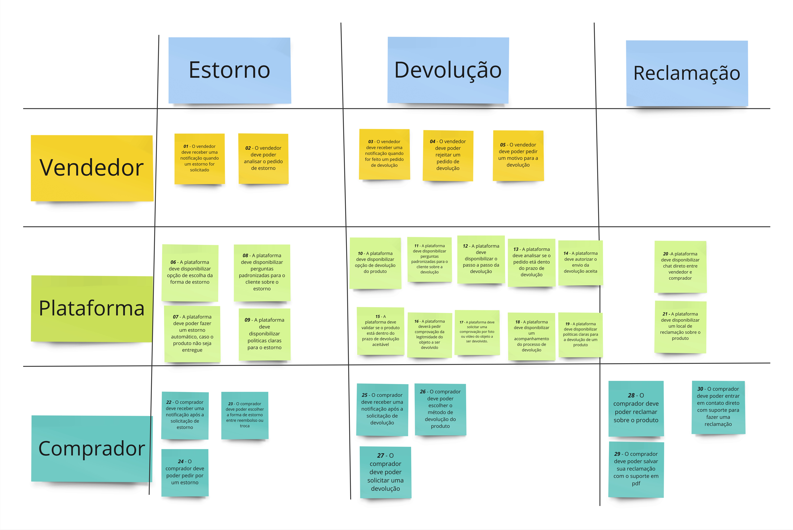

# Brainstorm

## Introdução

Brainstorm é uma técnica que fornece informações sobre os tipos de conteúdo e características que os usuários querem e desejam em um produto. Utilizada para levantar requisitos e aprender sobre novas características que os usuários apreciariam em um produto.

Uma sessão de brainstorming busca levantar de forma bastante livre um conjunto grande e abrangente de opiniões dos participantes em torno de um tema. Os resultados dessa atividade podem alimentar diretamente a especificação funcional e documentação de design.

## Metodologia

A sessão de brainstorming foi realizada via <a href="https://www.microsoft.com/pt-br/microsoft-teams">Teams</a> para a comunicação, e utilizando-se também da plataforma <a href="https://miro.com/pt/">Miro</a> para a construção e interaçãos com os quadros do brainstorm.

A sessão foi realizada com a participação de 9 membros do grupo, porém, com dois membros fazendo o papel de mediadores do Braisntorm, como demonstrado na <i>Tabela 2</i>, que permite que as pessoas da sessão não perca o foco e que esclarece as dúvidas do time em geral.

| Local                                                                                     | Data     | Horário      |
| ----------------------------------------------------------------------------------------- | -------- | ------------- |
| Reunião via <a href="https://www.microsoft.com/pt-br/microsoft-teams">Teams</a>| 09/09/23 | 10:00 - 11:00 |

 Tabela 1: Tabela de local e horário de reunião (Fonte: Henrique, 2023). 

| Participantes               |
| --------------------------- |
| Gabriel Ferreira (Mediador) |
| Henrique Pucci (Mediador)   |
| Chaydson Ferreira           |
| Mateus de Almeida           |
| Pedro Henrique              |
| Pedro Helias                |
| Samuel Gomes                |
| Lucas L. Frazão            |
| Lucas Lopes                 |

 Tabela 2: Tabela de partticipantes do Brainstorm (Fonte: Henrique, 2023). 

## Quadro de Requisitos

Com a participação da equipe, foi construído um quadro com os principais requisitos elicitados atraveś da sessão do Brainstorm. Esses requisitos foram separados á partir da visão de quem realizaria tal requisito (Vendedor, Plataforma e Comprador), e também separado em relação as suas ações no Fluxo (Devolução, Estorno e Reclamação). Assim como demonstrado no <i> Quadro 1</i> e na <i> Figura 1</i>.

<iframe width="768" height="432" src="https://miro.com/app/live-embed/uXjVMlfsPWY=/?moveToViewport=-914,-683,1642,1367&embedId=298238650226" frameborder="0" scrolling="no" allow="fullscreen; clipboard-read; clipboard-write" allowfullscreen></iframe>

 Quadro 1: Quadro interativo do Brainstorm (Fonte: Gabriel e Henrique, 2023). 

 Figura 1: Quadro do Brainstorm (Fonte: Gabriel e Henrique, 2023). 

## Requisitos Elicitados

A <i>Tabela 3</i> a seguir contém os Requisitos elicitados através do Brainstorm.

| id   | Requisito                                                                                   |
| ---- | ------------------------------------------------------------------------------------------- |
| BS01 | O vendedor deve receber uma notificação quando um estorno for solicitado                  |
| BS02 | O vendedor deve poder analisar o pedido de estorno                                          |
| BS03 | O vendedor deve receber uma notificação quando for feito um pedido de devolução         |
| BS04 | O vendedor deve poder rejeitar um pedido de devolução                                     |
| BS05 | O vendedor deve poder pedir um motivo para a devolução                                    |
| BS06 | A plataforma deve disponibilizar opção de escolha da forma de estorno                     |
| BS07 | A plataforma deve poder fazer um estorno automático, caso o produto não seja entregue     |
| BS08 | A plataforma deve disponibilizar perguntas padronizadas para o cliente sobre o estorno      |
| BS09 | A plataforma deve disponibilizar politicas claras para o estorno                            |
| BS10 | A plataforma deve disponibilizar opção de devolução do produto                          |
| BS11 | A plataforma deve disponibilizar perguntas padronizadas para o cliente sobre a devolução  |
| BS12 | A plataforma deve disponibilizar o passo a passo da devolução                             |
| BS13 | A plataforma deve analisar se o pedido etá dento do prazo de devolução                   |
| BS14 | A plataforma deve autorizar o envio da devolução aceita                                   |
| BS15 | A plataforma deve validar se o produto está dentro do prazo de devolução aceitável      |
| BS16 | A plataforma deverá pedir comprovação da legitimidade do objeto a ser devolvido          |
| BS17 | A plataforma deve solicitar uma comprovação por foto ou vídeo do objeto a ser devolvido. |
| BS18 | A plataforma deve disponibilizar um acompanhamento do processo de devolução               |
| BS19 | A plataforma deve disponibilizar politicas claras para a devolução de um produto          |
| BS20 | A plataforma deve disponibilizar chat direto entre vendedor e comprador                     |
| BS21 | A plataforma deve disponibilizar um local de reclamação sobre o produto                   |
| BS22 | O comprador deve receber uma notificação após a solicitação de estorno                 |
| BS23 | O comprador deve poder escolher a forma de estorno entre reembolso ou troca                 |
| BS24 | O comprador deve poder pedir por um estorno                                                 |
| BS25 | O comprador deve receber uma notificação após a solicitação de devolução             |
| BS26 | O comprador deve poder escolher o método de devolução do produto                         |
| BS27 | O comprador deve poder solicitar uma devolução                                            |
| BS28 | O comprador deve poder reclamar sobre o produto                                             |
| BS29 | O comprador deve poder salvar sua reclamação com o suporte em pdf                         |
| BS30 | O comprador deve poder entrar em contato direto com suporte para fazer uma reclamação     |

## Gravação da Reunião

Em <i>Vídeo 1</i>, está disponível a gravação da reunião em que foi feito a sessão do Braisntorm.

## Bibliografia
BARBOSA, Simone Diniz Junqueira; DA SILVA, Bruno Santana. Interação Humano - Computador. Rio de janeiro: Elsevier, 2010.Disponível em: <https://www.uniasselvi.com.br/extranet/layout/request/trilha/materiais/livro/livro.php?codigo=22393>. Acesso em: 14 set. 2023

## Histórico de versão

| Versão |    Data    |          Descrição          |            Autor            |      Revisor      |
| :-----: | :--------: | :----------------------------: | :-------------------------: | :---------------: |
|   1.0   | 14/09/2023 | Criação inicial do documento | Henrique e Gabriel Ferreira | Mateus e Lucas Lopes |