# Rich Picture

## Introdução

O Rich Picture é uma ferramenta essencial para entender problemas e outras situações que necessitam ser solucionadas ou entendidas, servindo para representar iconograficamente (mediante desenhos) regras de negócio, representação de ideias, quem são os envolvidos, dados ou informações por imagens ou textos, preocupações e outros componentes essenciais ao problema que está se tentando resolver ou cenário buscado. Um Rich Picture bem desenvolvido, traz como produto uma representação iconográfica (desenho) do ambiente ou sistema a ser analisado, assim ajudando a verificar e entender os problemas e limitações do sistema, com isso, é possível trabalhar e contribuir com outros artefatos para se ter ideias de contexto geral e ponto de vista diferentes buscando representar como o fluxo de informações e ações flui, tornando bem mais simples o desenvolvimento de soluções eficazes.

## Metodologia

 Para o desenvolvimento de um Rich Picture, será dada a opção aos membros de construírem o Rich Picture da maneira que acharem confortável. Pode ser feito à mão ou digitalmente, através de ferramentas como Draw.io e Whiteboard Microsoft que permite desenhar o Rich Picture.

Para a representação geral, que será a união das ideias e dos Rich Pictures de cada um dos membros que compõem o grupo em um novo único Rich Picture, será realizado de maneira virtual através do draw.io ou uma alternativa semelhante, como objetivo de que o mesmo seja mais refinado.

 Os Rich Pictures seguirão alguns fatores que deverão estar presentes em todos os Rich Pictures, tais como: <b>a definição de quais elementos representam os atores do sistema, os limites do sistema, onde os dados são guardados e o fluxo de dados</b>. Esses elementos são obrigatórios e deverão constar na legenda do Rich Picture. 

## Rich Picture Geral( Versão 1)

Na Figura 1 estão contidos a união dos rich pictures de todos os membros, assim como a sua legenda, localizada na Figura 2, o Rich Picture dos membros estão contidos na Tabela 1.

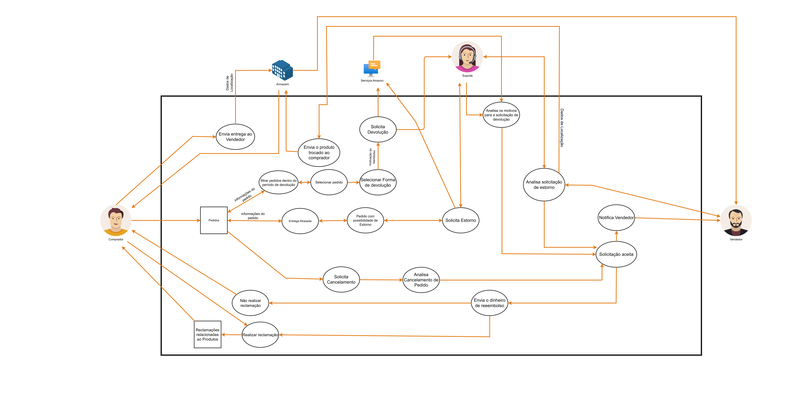

 Figura 1: Rich Picture Amazon G3 (Fonte: Gabriel e Henrique, 2023). 

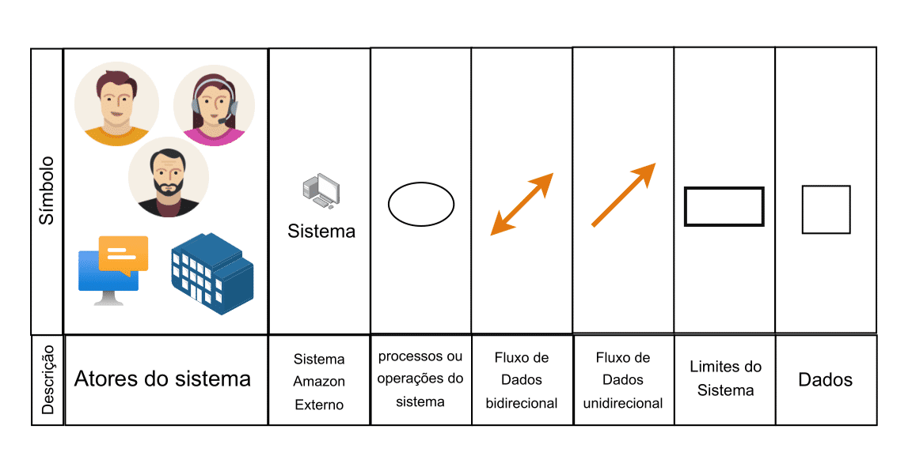

 Figura 2: Legenda Rich Picture Amazon G3 (Fonte: Gabriel e Henrique, 2023). 

## Rich Picture dos Membros

Na Tabela 1 está contida com o pensamento dos membros sobre o fluxo proposto(fluxo de devolução, estorno e defeito) em um rich picture.
 

| Membro                               | Rich Picture |
| ------------------------------------ | ------------ |
| Artur Vinicius Dias Nunes            | 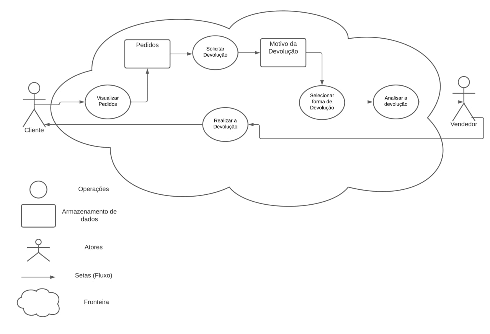         |
| Chaydson Ferreira da Aparecida       | 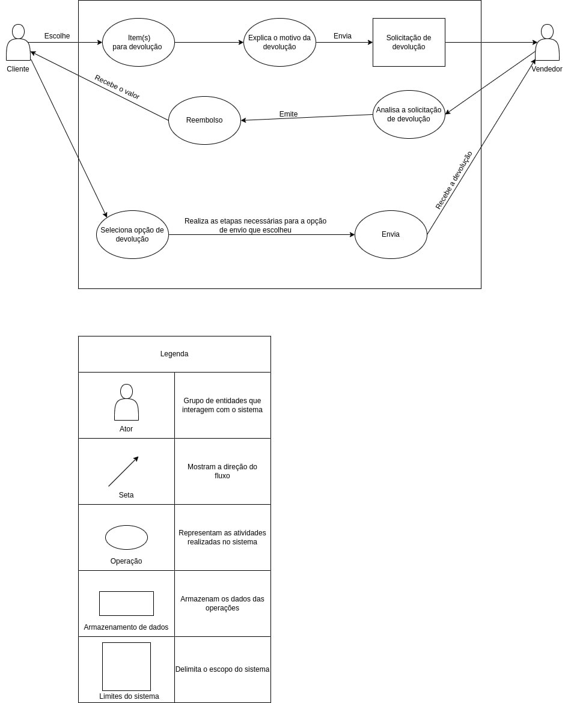              |
| Gabriel Ferreira da Silva            | 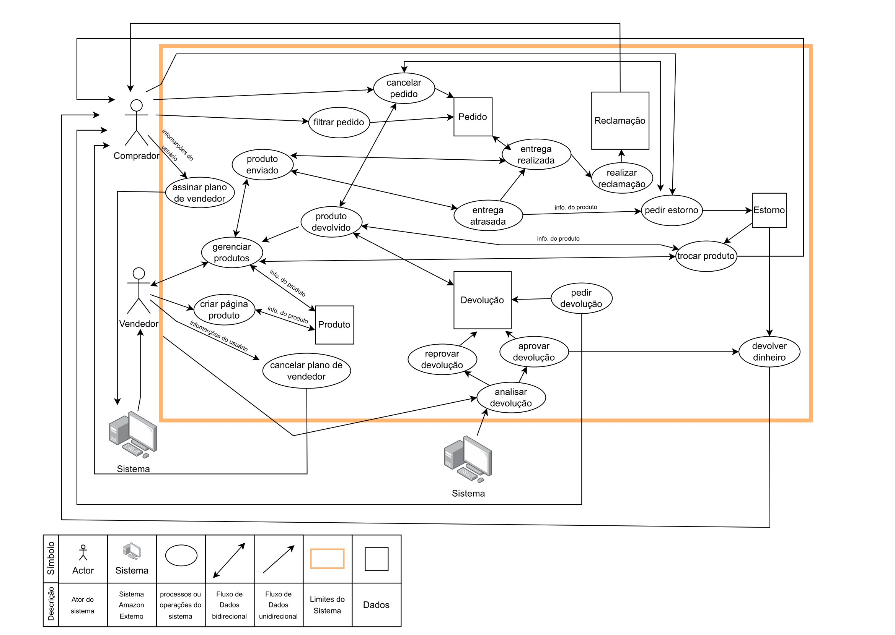              |
| Henrique Pucci da Silva Pinto        | 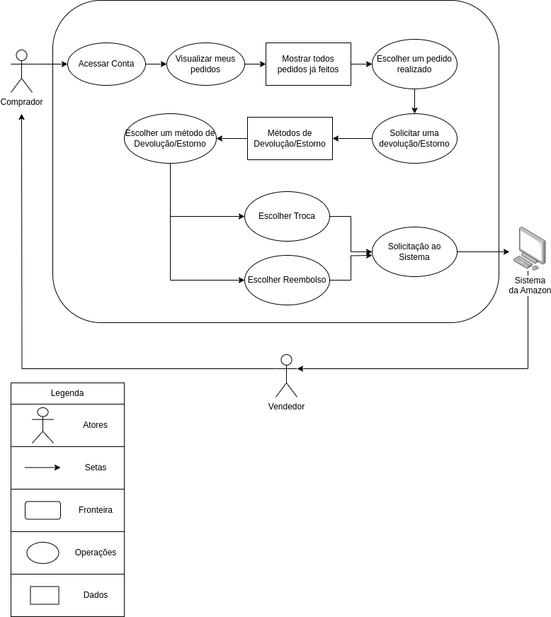              |
| Lucas Lopes Frazão                  | 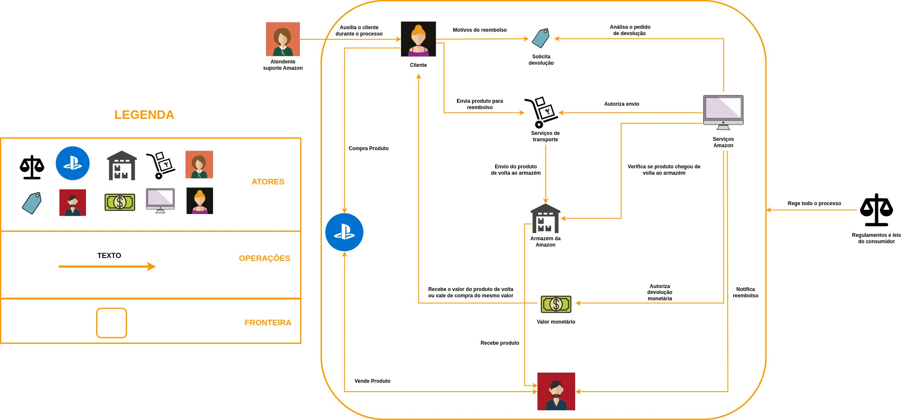              |
| Lucas Lopes Rocha                    | 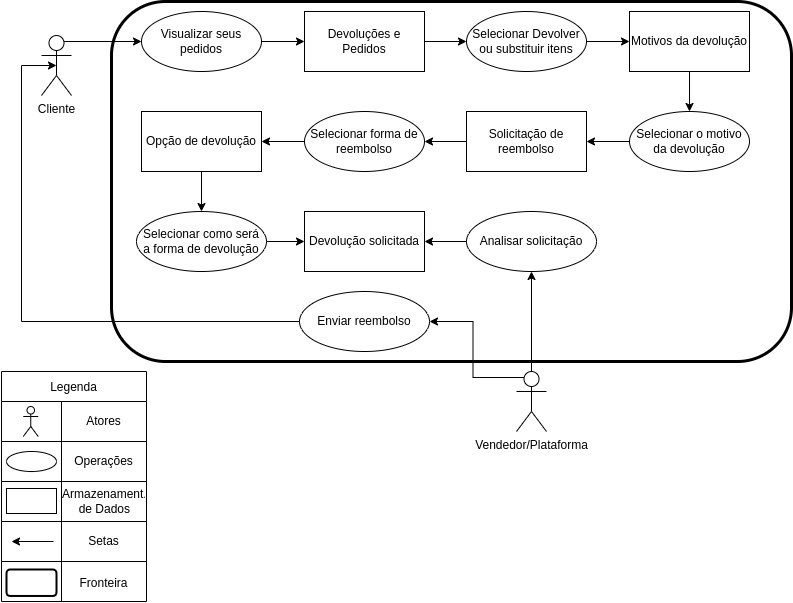              |
| Mateus de Almeida Dias               | 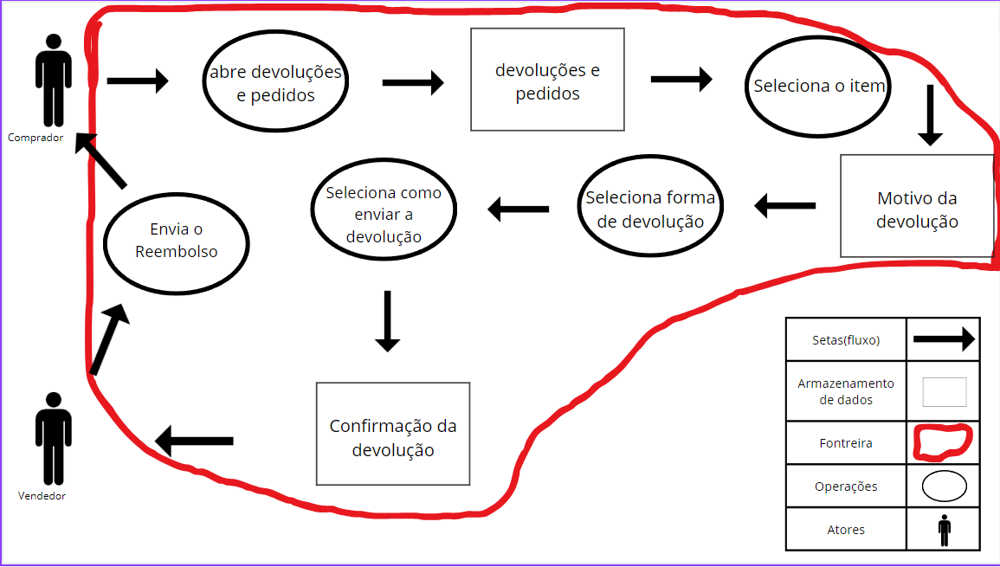             |
| Pedro Helias Carlos                  | 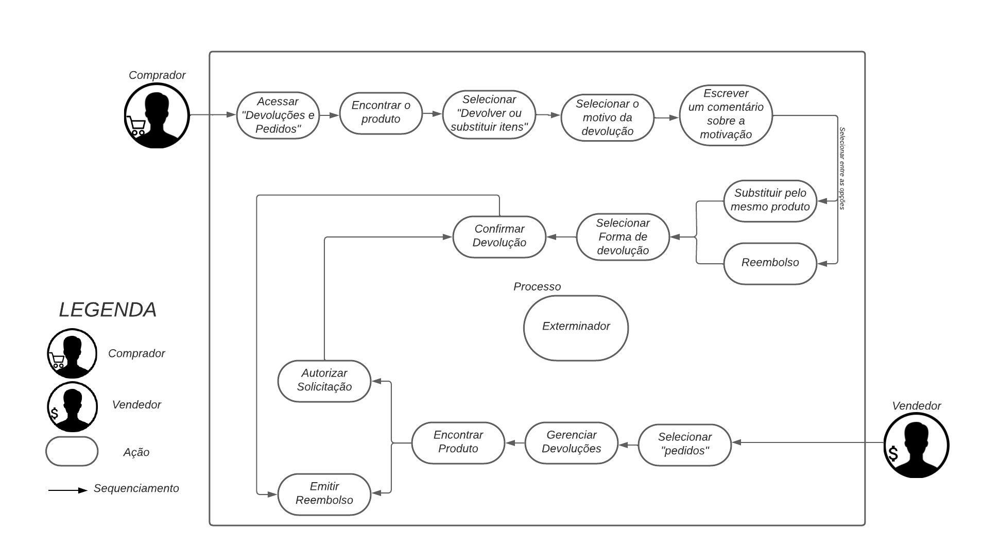              |
| Pedro Henrique Rodrigues de Carvalho | 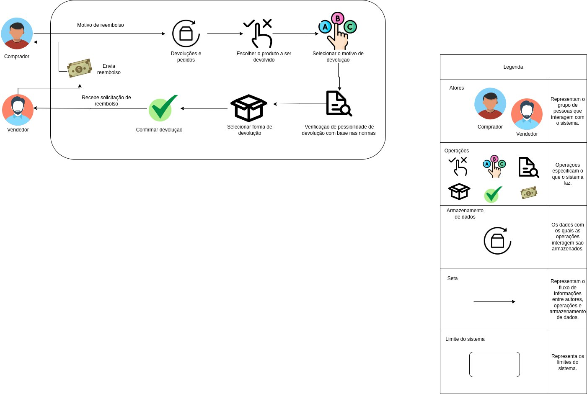              |
| Samuel Gomes de Souza                |     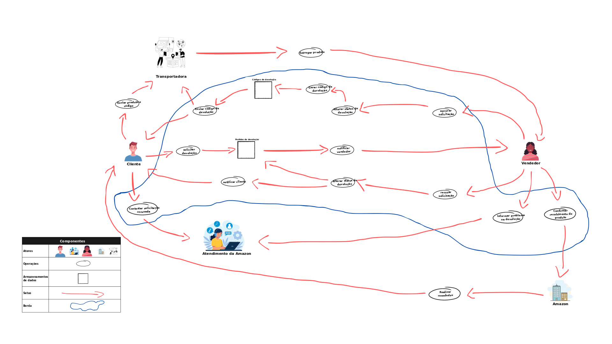         |

 Tabela 1: Rich Picture Membros (Fonte: Autores, 2023). 

## Bibliografia

> MONK, Andrew; HOWARD, Steve. The Rich Picture: A Tool for Reasoning About Work Context. The Rich Picture, New York, p. 1-10, abr. 1998. Disponível em: <https://www-users.york.ac.uk/~am1/RichPicture.pdf> . Acesso em: 13 set. 2023.

> Berg, Tessa. (2012). Rich Pictures: A valuable means to explore complex issues. Disponível em: <https://www.researchgate.net/publication/272019864_Rich_Pictures_A_valuable_means_to_explore_complex_issues> Acesso em: 13 set. 2023

## Histórico de versão

| Versão |    Data    |          Descrição          |            Autor            |      Revisor      |
| :-----: | :--------: | :----------------------------: | :-------------------------: | :---------------: |
|   1.0   | 13/09/2023 | Criação inicial do documento | Gabriel Ferreira e Henrique | Chaydson e Samuel |
