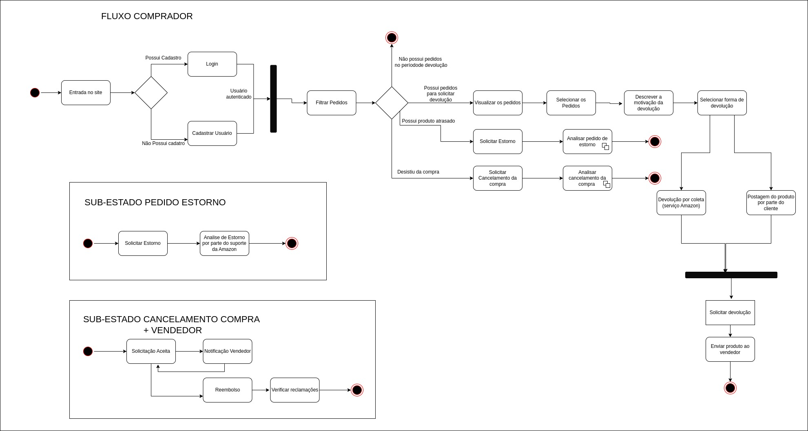

# Diagrama de Estados

## Introdução

O Diagrama de Estados é uma forma de representação dinâmica que modela transição de sistemas entre estados finitos, semelhante a máquina de estados. Máquinas de Estados são estruturas/modelos matemáticos que representam sistemas de computador ou circuitos lógicos. Para a representação desse modelo de diagramação, utiliza-se o UML. UML, acrônomo para Linguagem de Modelagem Unificada, consegue descrever as transições de um sistema ou modelo de forma técnica e coerente. 

## Componentes de um diagrama de Estado

O Diagrama de Estados é composto por componentes específicas, que auxíliam na representação da modelagem do sistema. As componentes podem ser descritas como:

- Estado Inicial: Demarca o ponto de entrada do sistema.
- Estado Final: Demarca o ponto de saída e finalização do sistema. Um sistema pode ter diversas saídas, sendo representadas ao decorrer da modelagem. 
- Evento: Representa as transições entre estados, projetando as informações que acompanham ou justificama a transição.
- Estado: Os estados representam blocos objetivos de um sistema, onde ações principais de um dado sistema ocorrem. 

Além das componentes citadas, ainda há componentes que representam seleções, decisões e barreiras. Há também componentes para representar o sub-estados, utilizadas quando se verifica a necessidade de representar um microsistema fora do foco principal da modelagem, mas igualmente importante para o funcionamento do mesmo. 

## Modelagem

<figcaption style="text-align: center">
    <b>Figura 1: Diagrama de Estados com os fluxos correspondentes</b>
</figcaption>

<figcaption style="text-align: center">
   <b>Autor: Elaboração Própria (Pedro Helias, Henrique e Samuel)</b>
</figcaption>

Foram realizados sub-estados do diagrama de estados para melhor destrinchar os fatos e eventos que o diagrama propõe. Nestes, foram explicitadas as operações que o Vendedor também realiza.

## Bibliografia

> O que é um diagrama UML. LUCIDCHART. Disponível em: <a href="https://www.lucidchart.com/pages/pt/o-que-e-uml#:~:text=um%20diagrama%20UML-,O%20que%20%C3%A9%20UML%3F,tanto%20estruturalmente%20quanto%20para%20comportamentos."> referência </a>. Acesso em 03 de Outubro de 2023.

> Diagrama de Estados. Universidade Federal de Uberlândia. Disponível em: <a href="https://www.facom.ufu.br/~abdala/DAS5312/Diagrama%20de%20Estados.pdf"> referência</a>. Acesso em 03 de Outubro de 2023.

## Histórico de versão

| Versão |    Data    |          Descrição           |          Autor          |       Revisor        |
| :----: | :--------: | :--------------------------: | :---------------------: | :------------------: |
|  1.0   | 03/10/2023 | Criação inicial do documento | Pedro Helias, Samuel, Henrique | Lucas Frazão e Chaydson |

‌