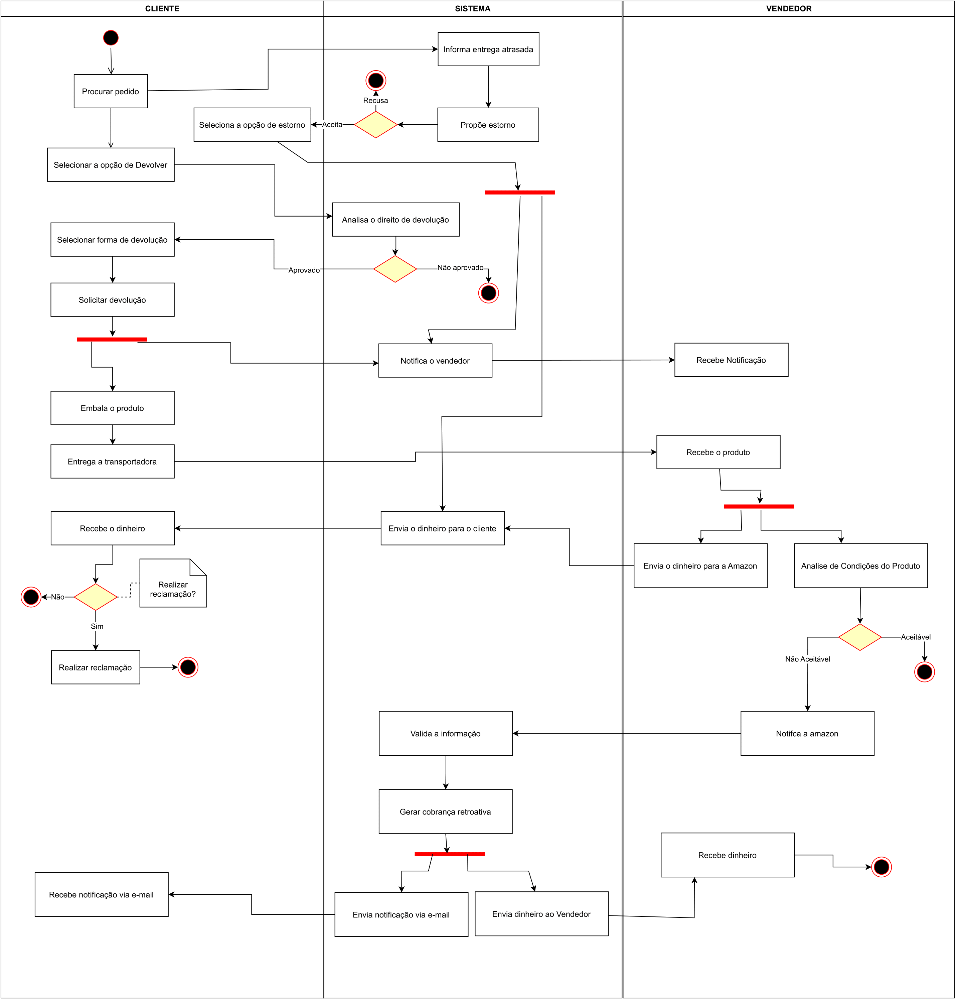

# Diagrama de Atividades

## Introdução

O diagrama de atividades é uma ferramenta na Linguagem de Modelagem Unificada (UML), que é utilizada para representar o comportamento de um sistema. Este tipo de diagrama, juntamente com outros, faz parte dos diagramas de comportamento da UML, descrevendo como as atividades e processos devem ocorrer em um sistema. Através de símbolos e elementos específicos, como início, fim, fusão e etapas no fluxo, os diagramas de atividades permitem uma comunicação clara e concisa entre as partes interessadas, facilitando a compreensão de um processo tanto para profissionais de negócios quanto para desenvolvedores de software.

Diante dessa necessidade, foi criado um diagrama de atividades com o propósito de representar de forma clara e visual o processo de devolução e estorno de produtos no site da Amazon.

## Objetivos

- Visualização de Processos: Os diagramas de atividade fornecem uma representação visual de um processo ou sistema, permitindo que as pessoas entendam facilmente como as atividades estão interconectadas e quais são suas relações.

- Modelagem de Comportamento: Os diagramas de atividades descrevem o comportamento dinâmico de um sistema, mostrando como ele responde a eventos e como as atividades são executadas em sequência ou concorrência.

- Documentação: Os diagramas de atividade servem como uma ferramenta de documentação poderosa para descrever processos complexos de maneira estruturada e organizada, o que é útil para futuras referências e comunicação entre equipes.

- Análise e Melhoria de Processos: Os diagramas de atividade permitem a análise crítica de processos existentes para identificar possíveis pontos de melhoria, ineficiências ou gargalos, ajudando a otimizar operações.

- Modelagem de Fluxo de Trabalho: Os diagramas de atividade são úteis para modelar fluxos de trabalho complexos em sistemas de automação, como sistemas de gerenciamento de fluxo de trabalho, sistemas de controle industrial e sistemas de gerenciamento de processos.

## Diagrama de Atividades

<figcaption style="text-align: center">
    <b>Figura 1: Diagrama de Atividades (UML)</b>
</figcaption>

<figcaption style="text-align: center">
   <b>Autor: Elaboração Própria (Pedro Henrique Rodrigues, Gabriel Ferreira, Matheus Almeida)</b>
</figcaption>

## Referências

- O que é diagrama de atividades UML? Lucidchart. Disponível em: <https://www.lucidchart.com/pages/pt/o-que-e-diagrama-de-atividades-uml>. Acesso em: 5 out. 2023.

- BÓSON TREINAMENTOS. O que é um Diagrama de Atividade UML - Introdução. Disponível em: <https://www.youtube.com/watch?v=_1vHj_j3zDY&ab_channel=B%C3%B3sonTreinamentos>. Acesso em: 5 out. 2023.

## Histórico de versão

| Versão |    Data    |          Descrição           |                            Autor                            |                                  Revisor                                  |
| :----: | :--------: | :--------------------------: | :---------------------------------------------------------: | :-----------------------------------------------------------------------: |
|  1.0   | 05/10/2023 | Criação inicial do documento | Pedro Henrique Rodrigues, Gabriel Ferreira, Matheus Almeida | PEDRO HELIAS CARLOS, HENRIQUE PUCCI DA SILVA PINTO, SAMUEL GOMES DE SOUZA |
