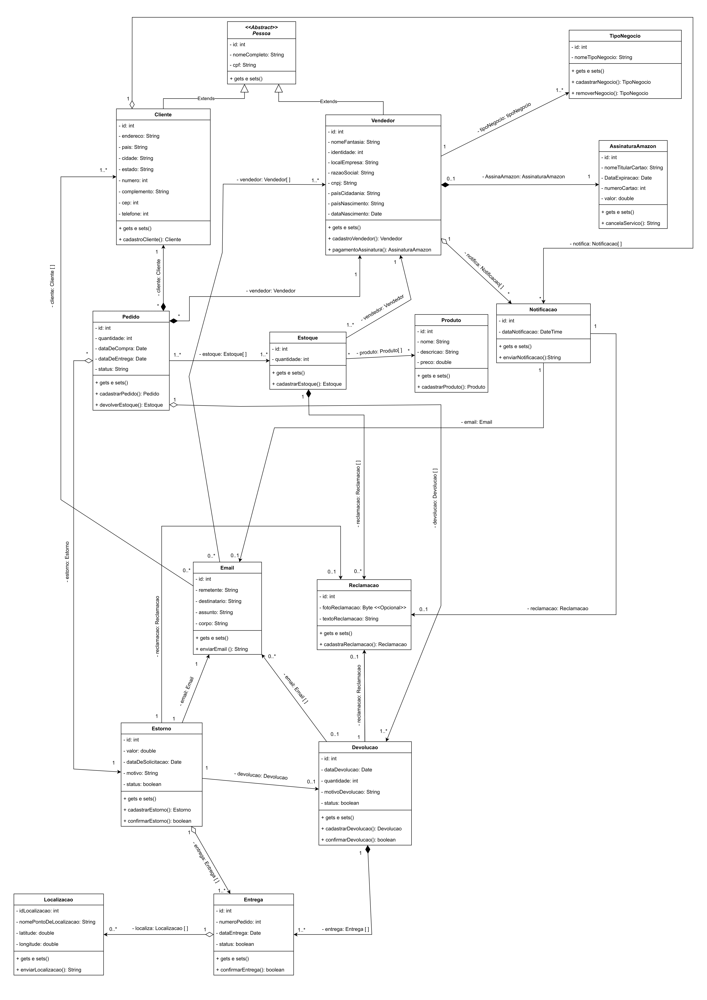

# Diagrama de Classes

## Introdução

O diagrama de classes é um diagrama que na Linguagem de Modelagem Unificada (UML) é utilizada para representar a estrutura arquitetural de um sistema. Este tipo de diagrama, juntamente com outros, faz parte dos diagramas de estruturas da UML, descrevendo estaticamente como um sistema deve ser construído além de sua composição, através de classes, atributos, métodos e relacionamentos entre essas classes. Dessa forma, o mesmo guarda os dados de uma classe em uma instância chamada Objeto. Juntamente ao software é possível entender como o sistema deve ser construído estruturalmente.

Com esse conceito apresentado foi, foi criado um diagrama de classes para atender a necessidade entender de se entender de uma forma facilitada como o sistema do site da Amazon funciona e que possíveis propostas podem ser adicionadas a mesma, tudo isso com foco no processo de Reclamação, Devolução e Estorno, sem deixar para trás pontos importantes como o Comprador e Vendedor.   

## Objetivos

## Diagrama de Classes

<figcaption style="text-align: center">
    <b>Figura 1: Diagrama de Classes (UML)</b>
</figcaption>

<figcaption style="text-align: center">
   <b>Autor: Elaboração Própria (Gabriel Ferreira, Matheus Almeida, Pedro Henrique Rodrigues)</b>
</figcaption>

## Referências

-Curso de UML O que é um Diagrama de Classes. Disponível em: <https://youtu.be/JQSsqMCVi1k?si=94cGZA2LdO1laBZz>. Acesso em: 07 de out. de 2023.

## Histórico de versão

| Versão |    Data    |          Descrição           |                            Autor                            |                                  Revisor                                  |
| :----: | :--------: | :--------------------------: | :---------------------------------------------------------: | :-----------------------------------------------------------------------: |
|  1.0   | 07/10/2023 | Criação inicial do documento | Pedro Henrique Rodrigues, Gabriel Ferreira, Matheus Almeida | PEDRO HELIAS CARLOS, HENRIQUE PUCCI DA SILVA PINTO, SAMUEL GOMES DE SOUZA |
