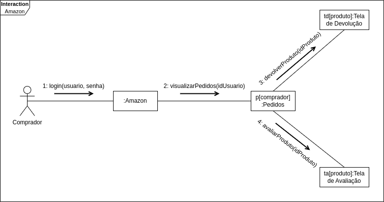
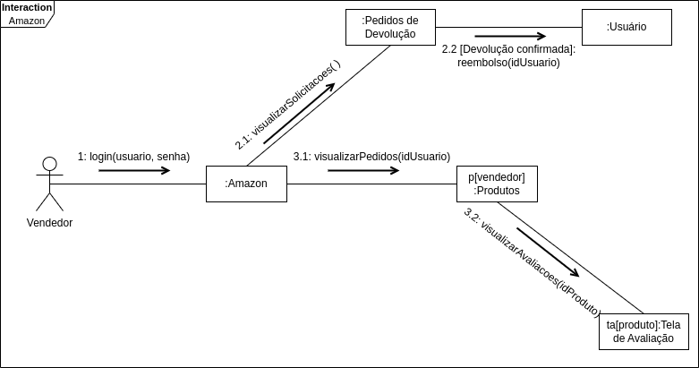

# Diagrama de Comunicação/Colaboração

## Introdução

Um diagrama de comunicação na UML (Unified Modeling Language) é um tipo de diagrama de modelagem de software que é usado para visualizar e descrever a interação entre os objetos ou elementos em um sistema. Ele se concentra principalmente nas mensagens que são trocadas entre os objetos e como essas mensagens fluem ao longo do tempo.

## Diagramas

### Perfil Comprador
- **Autores:** Lucas Lopes Rocha e Artur Vinicius Dias
- **Descrição:** Diagrama de Comunicação do Perfil Comprador
- **Data:** 04/10/2023
- **Versão:** 1.0

<figcaption align="center">Figura 1: Diagrama de Comunicação do Perfil Comprador. (Fonte: Autor, 2023)</figcaption>

### Perfil Vendedor
- **Autores:** Lucas Lopes Rocha e Artur Vinicius Dias
- **Descrição:** Diagrama de Comunicação do Perfil Vendedor
- **Data:** 04/10/2023
- **Versão:** 1.0

<figcaption align="center">Figura 2: Diagrama de Comunicação do Perfil Vendedor. (Fonte: Autor, 2023)</figcaption>

## Referências
> Diagrama de Comunicação.  Disponível em: <https://unbarqdsw2020-2.github.io/2020.2_G5_EasyCoffee/#/entrega2/diagramas_uml/diagrama_de_comunicacao>. Acesso em: 04 out. 2023.

> FAKHROUTDINOV, K. UML communication diagrams overview - graphical notations for lifeline, message, etc..  Disponível em: <https://www.uml-diagrams.org/communication-diagrams.html>. Acesso em: 04 out. 2023.

## Histórico de versão
| Versão | Data | Descrição | Autor | Revisor |
| :----: | :--: | :-------: | :---: | :-----: |
| 1.0 | 04/10/2023 | Criação inicial do documento | Lucas Lopes Rocha e Artur Vinicius Dias | Chaydson e Lucas Frazão |
| 1.1 | 06/10/2023 | Adição das imagens | Lucas Lopes Rocha e Artur Vinicius Dias | Chaydson e Lucas Frazão |
