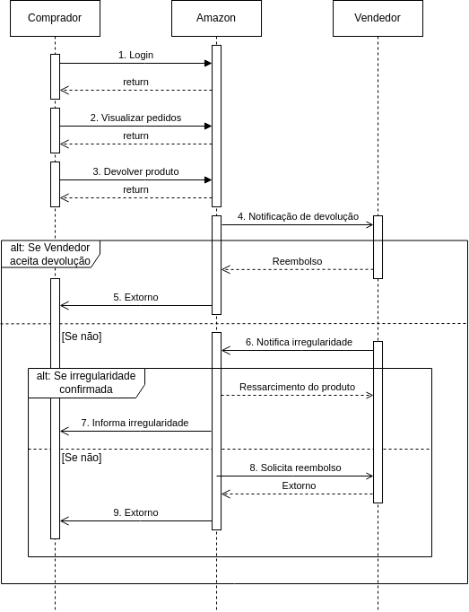

# Diagrama de Sequência

## Introdução

Um diagrama de sequência é uma ferramenta gráfica utilizada na modelagem de sistemas e processos, especialmente em engenharia de software e na análise de sistemas. Ele representa a interação entre objetos ou componentes em um sistema ao longo do tempo. Com esse diagrama, pode-se observar como os diferentes atores que fazem parte do sistema se comportam nas fases pelas quais o sistema passa.

## Objetivos

- Visualizar interações: Os diagramas de sequência permitem representar visualmente como os objetos interagem em um sistema ou processo ao longo do tempo. Isso ajuda a compreender o fluxo de controle e a troca de mensagens entre os objetos.

- Comunicar o comportamento dinâmico: Eles são uma ferramenta eficaz para comunicar o comportamento dinâmico de um sistema de software ou de um processo. Isso é útil para desenvolvedores, arquitetos, analistas e outras partes interessadas no projeto.

- Identificar sequências de ações: Os diagramas de sequência ajudam a identificar a ordem em que as ações ocorrem e como elas se relacionam umas com as outras. Isso é essencial para entender como um sistema responde a eventos ou entradas específicas.

## Modelagem

<figcaption style="text-align: center">
    <b>Figura 1: Diagrama de Sequência</b>
</figcaption>

<figcaption style="text-align: center">
   <b>Autor: Elaboração Própria (Chaydson Ferreira Henrique e Lucas Frazão)</b>
</figcaption>

## Bibliografia

> O que é um diagrama UML. LUCIDCHART. Disponível em: <a href="https://www.lucidchart.com/pages/pt/o-que-e-uml#:~:text=um%20diagrama%20UML-,O%20que%20%C3%A9%20UML%3F,tanto%20estruturalmente%20quanto%20para%20comportamentos."> referência </a>. Acesso em 08 de Outubro de 2023.

> Diagrama de sequência para aplicações modernas. Pisani da ArcH. Disponível em: <a href="https://www.youtube.com/watch?v=qaWShGkUiBo"> referência</a>. Acesso em 08 de Outubro de 2023.

## Histórico de versão

| Versão |    Data    |          Descrição           |          Autor          |       Revisor        |
| :----: | :--------: | :--------------------------: | :---------------------: | :------------------: |
|  1.0   | 08/10/2023 | Criação inicial do documento | Lucas Frazão e Chaydson | Lucas Lopes e Artur Vinicius Dias   |

‌