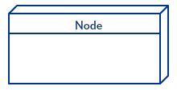
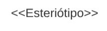
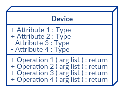

# Diagrama de Implantação

## Introdução

Os diagramas de implementação mostram os relacionamentos entre os componentes de software e hardware no sistema e a distribuição física do processamento, modelando assim a arquitetura física de um sistema. 

## Metodologia

O diagrama de implantação foi realizado utilizando a platafomra Lucid Chart, e seguindo por base o diagrama de comunicação. O diagrama de implantação segue o seu modelo utilizando alguns componentes padrões para confecção do mesmo, sendo eles:

### Nó

É uma entidade física que executa um ou mais componentes, subsistemas ou executáveis, como pode ser visto na figura 1. Um nó pode ser um hardware ou elemento de software.

<figcaption style="text-align: center">
    <b>Figura 1: Representação do Nó</b>
</figcaption>

### Esteriótipos

São identificadores dos nós, definindo o tipo deles. Como pode ser visto na figura 2.

<figcaption style="text-align: center">
    <b>Figura 2: Representação do Esteriótipo</b>
</figcaption>

### Artefatos

São elementos concretos que são causados por um processo de desenvolvimento. Como pode ser visto na figura 3.

<figcaption style="text-align: center">
    <b>Figura 3: Representação do Artefato</b>
</figcaption>

### Associação de Comunicação

Mostra o caminho de comunicação entre dois nós. Como pode ser visto na figura 4.

<figcaption style="text-align: center">
    <b>Figura 4: Representação da Associação</b>
</figcaption>

### Dispositivos

É um nó que é usado para representar um recurso computacional físico em um sistema. Como pode ser visto na figura 5.

<figcaption style="text-align: center">
    <b>Figura 5: Representação de Dispositivo</b>
</figcaption>

### Especificaçãoes de Implantação

É um arquivo de configuração. Descreve um artefato implantado me um nó. Como pode ser visto na figura 6.

<figcaption style="text-align: center">
    <b>Figura 6: Representação da Especificação</b>
</figcaption>

## Diagrama

O diagrama a seguir, visto na figura 7, foi desenvolvido pela equipe.

<figcaption style="text-align: center">
   <b>Figura 7: Diagrama de Implantação (UML)</b>
</figcaption>

<figcaption style="text-align: center">
   <b>Autor: Elaboração Própria (Artur Vinicius e Lucas Rocha)</b>
</figcaption>

## Referências

- Deployment Diagrams Overview. Disponível em: <https://www.uml-diagrams.org/deployment-diagrams-overview.html>. Acesso em: 7 out. 2023.

- Diagramas de Implementação. Disponível em: <https://www.ibm.com/docs/pt-br/rsas/7.5.0?topic=topologies-deployment-diagrams>. Acesso em: 7 out. 2023.

- O Guia Fácil de Diagramas de Implantação UML. Disponível em: <https://creately.com/blog/pt/diagrama/tutorial-do-diagrama-de-implantacao/>. Acesso em: 7 out. 2023.

## Histórico de versão

| Versão |    Data    |          Descrição           |          Autor          |       Revisor        |
| :----: | :--------: | :--------------------------: | :---------------------: | :------------------: |
|  1.0   | 07/10/2023 | Criação inicial do documento | Artur Vinicius e Lucas Rocha| Chaydson e Lucas Frazão |
|  1.1   | 09/10/2023 | Adicionando chamadas de textos, correção de código e ortografia | Gabriel Ferreira | -- |
