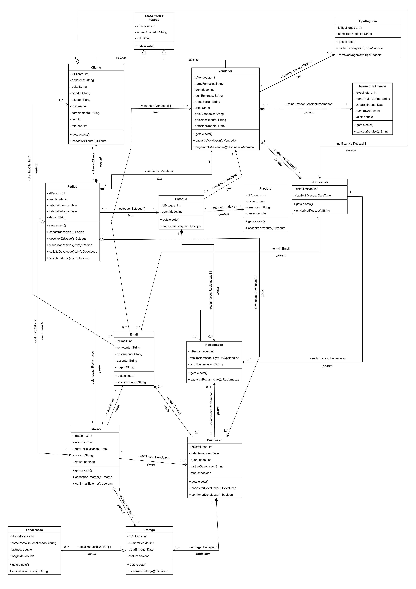

# Diagrama de Classes

## Introdução

O diagrama de classes é um diagrama que na Linguagem de Modelagem Unificada (UML) é utilizada para representar a estrutura arquitetural de um sistema. Este tipo de diagrama, juntamente com outros, faz parte dos diagramas de estruturas da UML, descrevendo estaticamente como um sistema deve ser construído além de sua composição, através de classes, atributos, métodos e relacionamentos entre essas classes. Dessa forma, o mesmo guarda os dados de uma classe em uma instância chamada Objeto. Juntamente ao software é possível entender como o sistema deve ser construído estruturalmente.

Com esse conceito apresentado foi, foi criado um diagrama de classes para atender a necessidade entender de se entender de uma forma facilitada como o sistema do site da Amazon funciona e que possíveis propostas podem ser adicionadas a mesma, tudo isso com foco no processo de Reclamação, Devolução e Estorno, sem deixar para trás pontos importantes como o Comprador e Vendedor.   

## Objetivos

- Exibir a estrutura do sistema: O diagrama de classes é um artefato que descreve a estrutura estática de um sistema, fornecendo uma visualização da estrutura do sistema, com inclusão de suas classes, atributos, operações e relações entre os objetos de maneira bem definida.

- Modelar o sistema: Esse artefato serve também como um esqueleto para modelar como o sistema será desenvolvido, definindo os tipos de dados dos atributos de uma classe, métodos e relacionamentos, o que ajuda partes interessadas a entender o sistema.    

- Auxiliar a Tomada de Decisões: Podem ser usados nos estágios iniciais de desenvolvimento de um projeto para tomar e informar decisões que podem ser debatidas, além de desenvolver os relacionamentos e componentes desse mesmo antes de se iniciar a parte de desenvolvimento.

- Identificar requisitos do sistema: Tal artefato serve para identificar processos e regras de negócios que estão ou não incluídos na aplicação e quais dados ou funcionalidades não estão presentes no desenvolvimento do sistema, e podem ser desenvolvidas mais para frente seguindo o "esqueleto" definido por esse artefato.

## Diagrama

A <i>Figura 1</i> contém o diagrama de classes proposto pelo grupo, utilizando-se de técnicas de UML para o desenvolvimento do mesmo.

<figcaption style="text-align: center">
    <b>Figura 1: Diagrama de Classes (UML)</b>
</figcaption>

<figcaption style="text-align: center">
   <b>Autor: Elaboração Própria (Gabriel Ferreira, Pedro Henrique Rodrigues)</b>
</figcaption>

## Referências

- Curso de UML O que é um Diagrama de Classes. Disponível em: <https://youtu.be/JQSsqMCVi1k?si=94cGZA2LdO1laBZz>. Acesso em: 07 de out. de 2023.

- Nikiforova, Oksana & Sejans, Janis & Cernickins, Antons. (2011). Role of UML Class Diagram in Object-Oriented Software Development. J. Riga Technical University. 44. 65-74. 10.2478/v10143-011-0023-4. Disponível em: <https://www.researchgate.net/publication/220625913_Role_of_UML_Class_Diagram_in_Object-Oriented_Software_Development> .Acesso em: 07 de out. de 2023.

## Histórico de versão

| Versão |    Data    |          Descrição           |                            Autor                            |                                  Revisor                                  |
| :----: | :--------: | :--------------------------: | :---------------------------------------------------------: | :-----------------------------------------------------------------------: |
|  1.0   | 07/10/2023 | Criação inicial do documento | Pedro Henrique Rodrigues, Gabriel Ferreira | Pedro Helias Carlos, Henrique Pucci da Silva Pinto, Samuel Gomes de Souza |
|  1.1   | 08/10/2023 | Revisão do diagrama de classes | Gabriel Ferreira | Pedro Henrique Rodrigues |
