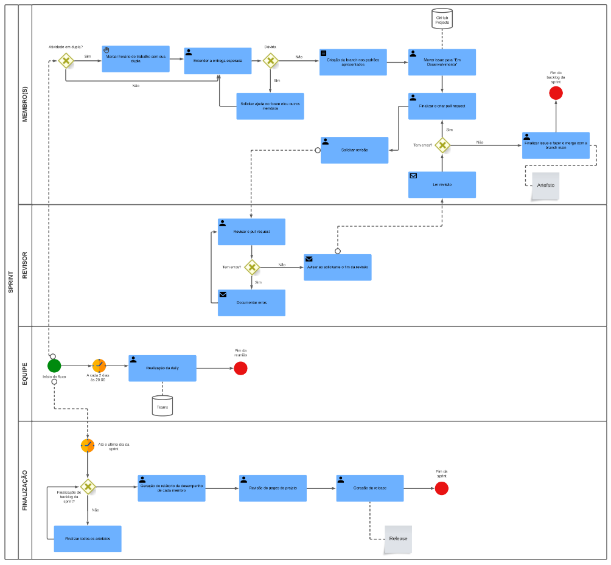
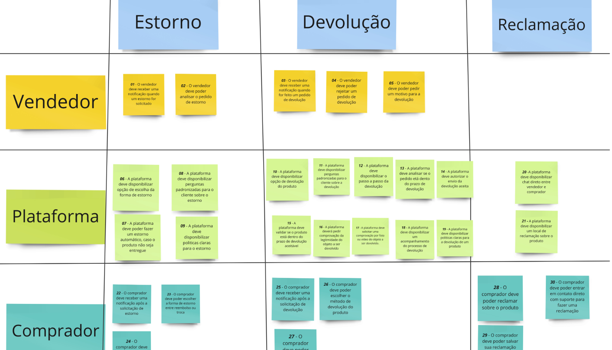
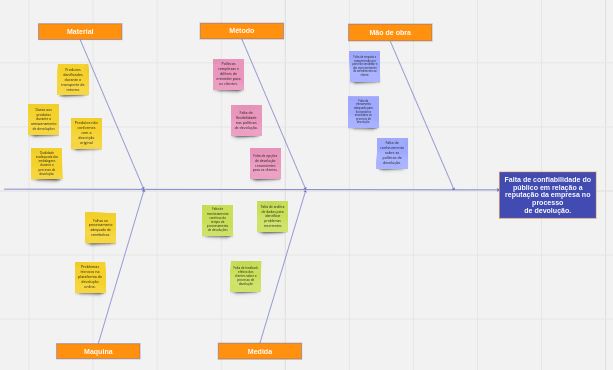
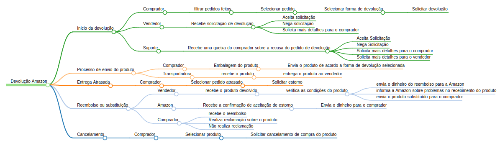
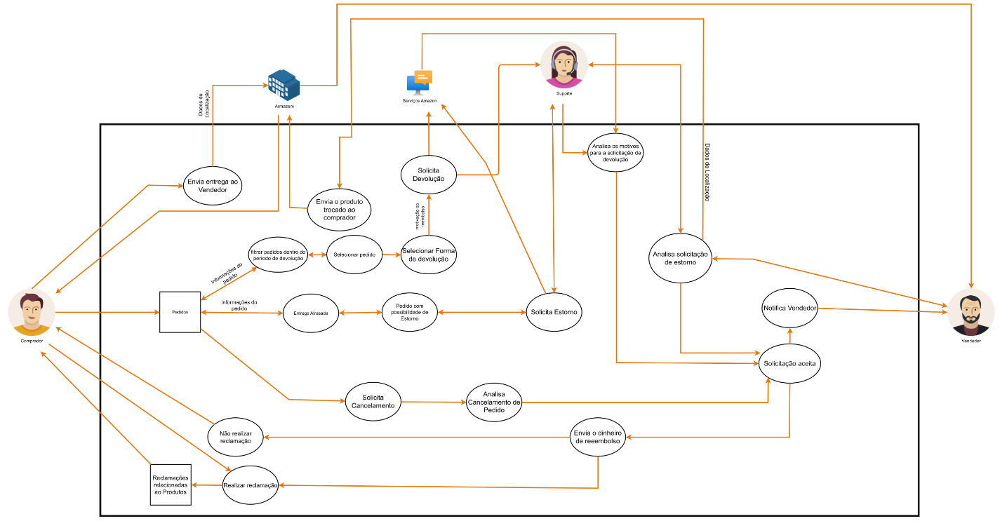

# Projeto Amazon

**Código da Disciplina**: FGA0208  
**Número do Grupo**: 03  

## Alunos

| Foto                                                                                 | Matrícula  | Aluno                                |
| ------------------------------------------------------------------------------------ | ---------- | ------------------------------------ |
|   | 19/0142421 | ARTUR VINICIUS DIAS NUNES            |
|   | 21/1030700 | CHAYDSON FERREIRA DA APARECIDA       |
|   | 20/0018060 | GABRIEL FERREIRA DA SILVA            |
|   | 20/2016506 | HENRIQUE PUCCI DA SILVA PINTO        |
|   | 21/1031771 | LUCAS LOPES FRAZAO                   |
|   | 20/2023903 | LUCAS LOPES ROCHA                    |
|   | 19/0142260 | MATEUS DE ALMEIDA DIAS               |
|   | 14/0158278 | PEDRO HELIAS CARLOS                  |
|   | 21/1031459 | PEDRO HENRIQUE RODRIGUES DE CARVALHO |
|   | 21/1030881 | SAMUEL GOMES DE SOUZA                |

## Sobre

Contextualize, usando referências, links, e outros materiais como fontes.

O Projeto Grupo 03: Amazon é uma iniciativa dedicada a analisar e compreender profundamente a operação da Amazon, uma das maiores empresas de comércio eletrônico do mundo. Este projeto se concentra em três componentes principais: o perfil do comprador, o perfil do vendedor e a plataforma da Amazon, juntamente com os processos envolvidos nos pedidos de reclamação, devolução e estornos de produtos e valores.

## Screenshots Primeira Entrega <<FOCO: DSW(Base)>>

 
 
 
 
 

## Screenshots Segunda Entrega <<FOCO: DSW(Modelagem)>>

<figcaption style="text-align: center">
    <b>Diagrama de componentes</b>
</figcaption>

<figcaption style="text-align: center">
    <b>Diagrama de classe</b>
</figcaption>

<figcaption style="text-align: center">
    <b>Diagrama de atividades</b>
</figcaption>

<figcaption style="text-align: center">
    <b>Diagrama de estados</b>
</figcaption>

## <<FOCO: DSW(Padrões de Projeto)>>

Esse módulo/tópico será avaliado via Prova.
Portanto, sem necessidade de Screenshots.

## Screenshots Terceira Entrega (FINAL) <<FOCOS: Arquitetura & Reutilização de Software & PROJETO FINAL>>

Adicione 2 ou mais screenshots em termos de artefatos da Quarta Entrega.

## Descritivo dos Principais Aspectos Técnicos

**Principal(is) Metodologia(s) Adotada(s)**: xxxxxx ` `
**Principais Linguagens Utilizadas e/ou Pretendidas**: xxxxxx ` `
**Principais Tecnologias Utilizadas e/ou Pretendidas**: xxxxxx ` `
**Principal(is) Estilo(s) Arquitetural(is) Adotado(s)**: xxxxxx ` `

## Há algo a ser executado?

( ) SIM

( ) NÃO

Se SIM, insira um manual (ou um script) para auxiliar ainda mais os interessados na execução.

## Informações Complementares

Quaisquer outras informações adicionais podem ser descritas nessa seção.
